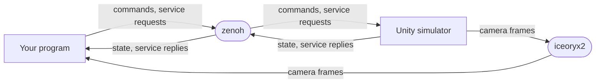

# Getting started

What the simulator is, what it is not, and what you will have working by the end of this chapter.

## What the simulator is

The Ubicoders virtual robots simulator is a Unity application that runs a rigid-body
physics world containing one or more robots. Each robot publishes a full state snapshot at
25 Hz, accepts commands, answers a small set of request/response services, and can stream
camera frames. It is a target for control code: you write the controller, the simulator
provides the plant.

`vrobots_sdk` is the client side of that conversation. One program behaves like one
embedded system bound to one robot: construct, connect, then run a plain control loop.

## What it is not

- **It is not a robotics framework.** There is no scheduler, no node graph, no message
  passing between your components. The SDK gives you a handle and gets out of the way.
- **It does not stabilise anything for you.** Sending pulse widths to a multirotor drives
  the thrust curves directly. There is no attitude hold and no rate damping between your
  numbers and the rotors.
- **It is not a physical robot.** Truth blocks in the state snapshot are simulator-exact
  values no real vehicle could know. They exist so you can measure your estimator against
  them, not so you can fly on them.
- **It does not manage your robot's lifetime.** A robot you create outlives the process
  that created it. See [Hello service](07-hello-service.md).

## One core, three languages

The Rust crate is the single implementation. The C++ SDK is a header-only RAII wrapper
over a C ABI, and the Python SDK is a PyO3 binding, both over that same Rust core. The
bindings add sugar, not behaviour, so lifecycle, snapshots and timestamps behave
identically by construction and the three surfaces cannot drift.

This chapter is written in Rust. Every example under `examples/rust/src/bin/` is mirrored
one for one in `examples/python/` and `examples/cpp/`, printing the same numbers.

## How your program reaches the robot

Two transports carry the traffic, and they are not interchangeable.

zenoh carries states, commands, setpoints and services, and it crosses a network: the
simulator can run on another machine if you point the SDK at a router. iceoryx2 carries
camera frames through shared memory, which makes it fast and makes it **same-host only**.
A remote simulator will therefore answer `states()` and refuse to deliver a single frame.

The wire format on both is FlatBuffers, and the version pins are exact on purpose. A
mismatch does not raise an error, it delivers nothing, which reads as "the simulator is not
publishing". [Installing the SDK and the simulator](01-install.md) shows how to print the
pins this build speaks.

> **Note.** The transports and the topic names they carry are the subject of
> [Two transports, one simulator](../ch02-concepts/01-transports.md) and
> [The topic namespace](../ch02-concepts/02-topics.md). This chapter uses them without
> explaining them further.

## What you will have by the end

Working through the eight pages of this chapter, in order, leaves you with:

- The SDK installed and the simulator running, on Windows, Ubuntu or WSL.
- Proof, from the `vrobots` command line tool, that the simulator is publishing and under
  which system id.
- A program that reads a multirotor's position at a rate you choose.
- A multirotor climbing under pulse widths you sent.
- A truck driving a gentle left arc.
- A camera mounted, frames read, and the camera unmounted again.
- A robot created from code and deleted from code.

Each of those is one of the first five example programs, run unmodified. Nothing in this
chapter asks you to write a program from scratch.

**Next:** [Installing the SDK and the simulator](01-install.md)

**See also:** [The shape of a program](../ch02-concepts/04-program-shape.md), [Five rules that explain everything](../ch02-concepts/06-five-rules.md), [When nothing happens](08-troubleshooting.md)
