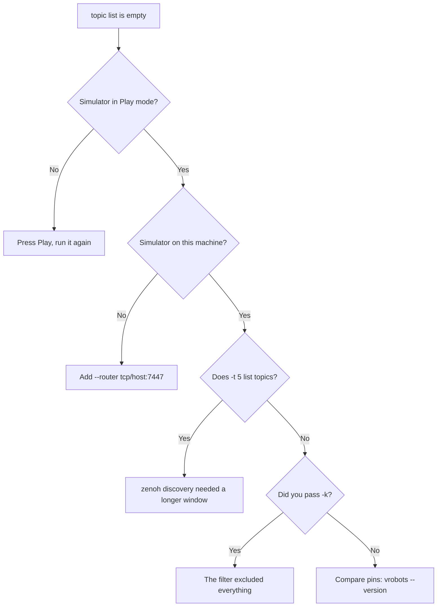

# First contact: is anything publishing?

Use the vrobots command to prove the simulator is talking before you write any code.

```sh
vrobots topic list
```

## What a healthy scene looks like

`topic list` opens a zenoh session, listens for a window, and reads the iceoryx2 registry.
Anything under `vrobots/**` that speaks during that window appears.

```text
wire       Hz     bytes  topic
[z]      25.0     33800  vrobots/1/z/state
[i]         -         -  vrobots/1/i/cam/front_left/720p_rgba8

2 topic(s); zenoh observed over 1.5s
[z] zenoh, measured by listening.  [i] iceoryx2, read from the registry:
    it exists, but Hz/bytes were not measured -- same host only.
```

The four columns:

| Column | Meaning | When it shows `-` |
|---|---|---|
| `wire` | `[z]` zenoh, `[i]` iceoryx2 | never |
| `Hz` | measured publish rate over the window | always for `[i]` entries |
| `bytes` | total payload bytes seen in the window | always for `[i]` entries |
| `topic` | the full key, which is also the iceoryx2 service name | never |

The dashes are the load-bearing detail. zenoh has no registry, so a `[z]` row means the
topic **actually published while you were listening** and its numbers are real
measurements. iceoryx2 does have a registry, so an `[i]` row means the service is defined;
it may be streaming or it may be a leftover, and a row marked `(stale: no process
attached)` is one whose owning process is gone.

> **Note.** The system id is the second path segment: `vrobots/1/z/state` is robot 1.
> This is how you find out which ids the scene really has, which matters because ids are
> allocated at scene load and keep incrementing. See
> [System ids, and the two kinds of robot](../ch02-concepts/03-sys-id.md).

Two flags are worth knowing now: `-k` filters keys by case-insensitive substring, and `-t`
sets the zenoh observation window in seconds (default 1.5).

## What an empty list means

With nothing running, the tool tells you what it ruled out:

```text
(no topics)

Nothing published on `vrobots/**` in 1.5s, and no iceoryx2 camera
stream is registered. Usually one of:
  - the simulator is not in Play mode
  - it is on another machine (pass --router tcp/<host>:7447)
  - the window was too short for zenoh discovery (try -t 5)
```

An empty list is a legitimate result, not an error, and the command still exits 0. Work
the three causes in order.



Loading a project into the Unity editor is not enough: the robots publish only while the
scene is playing. A remote simulator needs `--router tcp/<host>:7447`, and even then only
the `[z]` rows will appear, because iceoryx2 camera streams cannot cross hosts at all.

## What rate am I actually getting?

Once a topic is listed, watch that one key. The argument is an exact key expression; there
are no wildcards.

```sh
vrobots topic hz vrobots/1/z/state
```

```text
vrobots/1/z/state  [z]  watched 5.0 s

  rate          25.00 Hz      126 samples over a 5.000 s span
  interval   mean 40.00 ms    min 39.10   max 41.20   jitter 0.42 (sd)
  latency    mean 1.20 ms    min 0.80   max 2.10   publish stamp -> here
  seq        1041 -> 1166      0 gap(s), 0 missed
  payload        1352 B avg   33.8 kB/s over the window
```

Every line reports a spread as well as a summary, because a mean interval on its own hides
the one long stall that broke a control loop. The two numbers to read first are the **max
interval** and the **gap count**: together they explain a loop that stutters even though
the average rate looks correct. `-w` changes the window, which defaults to 5 seconds.

> **Gotcha.** Silence here is a failure, unlike `topic list`. If nothing arrives, `topic
> hz` returns a timeout naming the three things it could be: an idle topic, a typo in the
> key (a zenoh subscribe on a wrong key is silent, never an error), or a simulator on
> another host.

**Next:** [Hello states](03-hello-states.md)

**See also:** [The vrobots command](../ch08-tooling/01-cli.md), [Measuring rates](../ch08-tooling/05-rates.md), [Discovery from code](../ch08-tooling/02-discovery-from-code.md)
