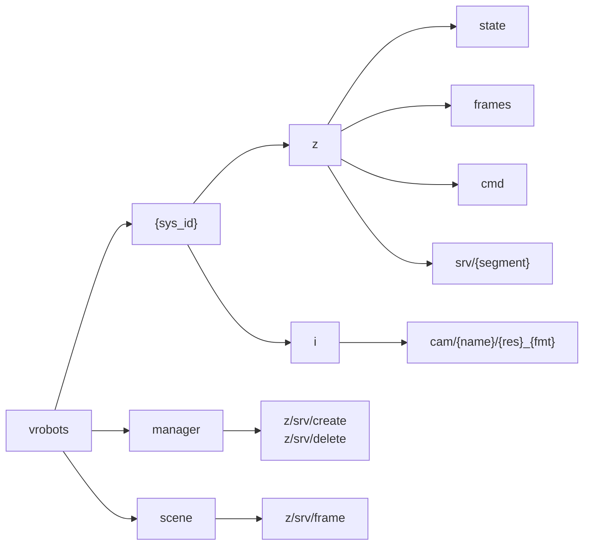

# The topic namespace

Every key the simulator publishes or subscribes, and how a robot's id fits into it.

## One rule generates every name

Every key in the system has the shape `vrobots/<sys_id>/<transport>/<subject...>`.
The segment after the id names the transport: `z` for zenoh, `i` for iceoryx2. Two
reserved words, `manager` and `scene`, sit where a system id would, so a swarm-wide
service can never collide with a robot's own.



Both ends of a wire must agree on these names byte for byte, and a mismatch is
**silent**: a subscriber on a slightly wrong key never fires at all. That is why no
call site in the SDK builds a name inline. Every one of them comes from the
`vrobots_sdk::topics` module, which mirrors the simulator's own `VRobotsTopics.cs`,
and it is public so your code can print the same string the simulator uses.

## The full pattern table

| Pattern | Transport | Direction | Contents |
|---|---|---|---|
| `vrobots/{sys_id}/z/state` | zenoh | sim publishes | full state, 25 Hz |
| `vrobots/{sys_id}/z/cmd` | zenoh | sim subscribes | commands; many-to-many, readable by clients |
| `vrobots/{sys_id}/z/srv/{segment}` | zenoh | request/response | per-robot services |
| `vrobots/{sys_id}/i/cam/{name}/{res}_{fmt}` | iceoryx2 | sim publishes | raw camera frames |
| `vrobots/manager/z/srv/create` | zenoh | request/response | spawn a robot |
| `vrobots/manager/z/srv/delete` | zenoh | request/response | remove a robot |
| `vrobots/scene/z/srv/frame` | zenoh | request/response | scene-level coordinate frame |

Two further per-robot zenoh keys exist and are covered where they are used.
`vrobots/{sys_id}/z/frames` publishes the coordinate-frame definitions that result
from a robot's frame configuration, which is a different thing from the `srv/frames`
service that sets them: [Coordinate frames](../ch06-services/04-frames-config.md)
covers both. `vrobots/{sys_id}/z/estimate` carries an external state estimate that
the fixed wing can be told to fly on instead of the truth, described in
[Fixed wing control](../ch04-commands/05-fixed-wing.md).

A concrete camera key, with every placeholder filled in:

```text
vrobots/1/i/cam/front_left/720p_rgba8
```

The `{res}_{fmt}` segment is built from the resolution and pixel format you asked
for, which is why changing a camera's format renames its stream. The full list of
service segments is in [Appendix A: Topic reference](../appendix-a-topics.md); the
ones a given robot answers depend on its type, and asking for one it does not serve
is how a capability probe works.

## The id slot is the routing

There is no addressing anywhere else in a message. A robot subscribes to its own
`z/cmd` and nothing else, so the id in the key **is** the delivery decision. Send a
command with the wrong id and it is not misrouted to another robot; it is received
by whichever robot owns that key, and the robot you meant hears nothing.

> **Gotcha.** A wrong `sys_id` and a command a robot does not implement look
> identical from outside: the state stream does not change. Confirm the id
> against `vrobots topic list` before suspecting the command.

## Wildcards

Two wildcard keys are worth knowing, both zenoh only.

| Constant | Key | Use |
|---|---|---|
| `topics::ALL` | `vrobots/**` | the discovery subscribe; everything the sim publishes |
| `topics::ALL_STATES` | `vrobots/*/z/state` | one subscriber for every robot's state |

`ALL_STATES` is the shape a swarm program wants: fifty `VirtualRobot` handles is
fifty sessions and fifty subscriber threads, where one subscription on the wildcard
is one of each. That is a different program from the one this book teaches, and the
key is here so it is buildable.

Wildcards work for subscribing, not for measuring.
[`measure_rate`](../ch08-tooling/05-rates.md) and `vrobots topic hz` need an exact
key and reject a wildcard with `VrError::InvalidArgument`.

## Reading the namespace back

`vrobots topic list` is the ground truth for what exists right now, and it is the
first command to run when something is not responding. It reports the transport tag,
the measured rate for zenoh topics, and the registry entry for iceoryx2 ones.
[The vrobots command](../ch08-tooling/01-cli.md) documents the flags;
[Discovery from code](../ch08-tooling/02-discovery-from-code.md) does the same
listing from inside a program via `list_topics`.

`topics::sys_id_of(key)` parses the id back out of a key, returning `None` for
`manager` and `scene`. That is the right answer rather than a parse failure: those
two scopes belong to no robot.

**Next:** [System ids, and the two kinds of robot](03-sys-id.md)

**See also:** [Appendix A: Topic reference](../appendix-a-topics.md), [The vrobots command](../ch08-tooling/01-cli.md), [More than one robot](../ch08-tooling/06-multi-robot.md)
