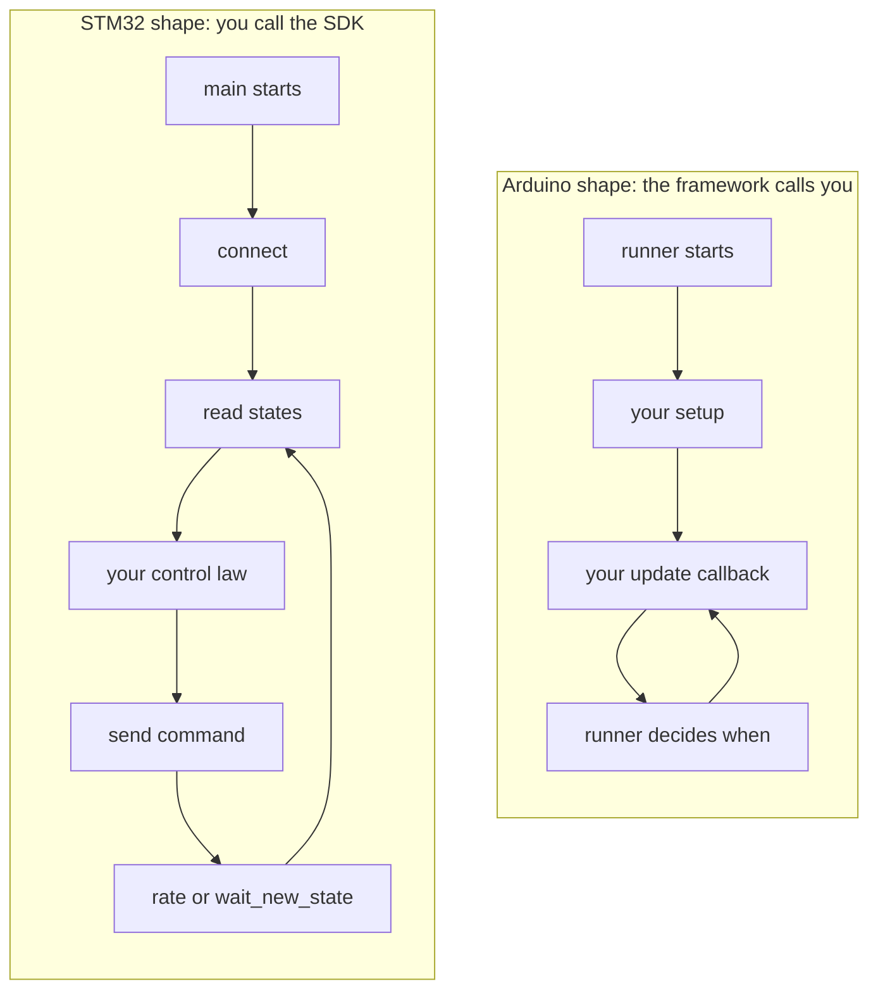

# The shape of a program

The SDK never calls your code: main does setup and owns the loop.

## Two shapes, and this SDK is the second one

Robotics clients come in two shapes. In the first, a framework owns the program: you
subclass something, fill in `setup()` and `update()`, hand the class to a runner, and
the runner calls you. In the second, you own the program: `main()` does its setup and
then runs a plain loop, calling the library when it wants something.

The first is the Arduino shape. This SDK is deliberately the second, the STM32 shape.



There is no base class, no runner, no `setup()`/`update()` pair, and no registration
call. **The SDK never calls your code.** Every arrow in the right-hand diagram is a
call your `main` makes.

## The canonical program

This is the whole shape, and every example in the book is a variation on it. From
`book/.research/00-shared.md`, which quotes the crate's own documentation in
`crates/vrobots-sdk/src/lib.rs`:

```rust
use vrobots_sdk::{RobotType, VirtualRobot, VrError};

fn main() -> Result<(), VrError> {
    // ===== setup =====
    let robot = VirtualRobot::connect(RobotType::Multirotor, Some(1))?;

    // ===== loop =====
    loop {
        let s = robot.states();               // latest snapshot, never torn, never blocks
        let [x, y, z] = s.kin.lin_pos;
        println!("State t={:.3} pos=({x:.3},{y:.2},{z:.2})", s.elapsed);

        robot.set_mr_pwm([1501.0; 4])?;       // your controller's output
        robot.rate(100.0);                    // drift-compensated pacing, Hz
    }
}
```

<details>
<summary>The same in C++ (the header comment on <code>cpp/include/vrobots_sdk.hpp</code>)</summary>

```cpp
#include <vrobots_sdk.hpp>

int main() {
    vrsdk::VirtualRobot robot(vrsdk::RobotType::Multirotor, /*sys_id=*/1);
    robot.connect();
    while (true) {
        vrsdk::State s = robot.states();
        std::printf("t=%.3f\n", s.elapsed);
        robot.set_mr_pwm({1501, 1501, 1501, 1501});
        robot.rate(100.0);
    }
}
```

</details>

<details>
<summary>The same in Python (the module docstring on <code>crates/vrobots-sdk-py/python/vrsdk/__init__.py</code>)</summary>

```python
from vrsdk import VirtualRobot, RobotType

def main():
    # ===== setup =====
    mr = VirtualRobot(RobotType.MULTIROTOR, sys_id=1)
    mr.connect()

    # ===== loop =====
    while True:
        s = mr.states
        x, y, z = s.kin.lin_pos
        print(f"State t={s.elapsed:.3f} pos=({x:.3f},{y:.2f},{z:.2f})")
        mr.set_mr_pwm(1501, 1501, 1501, 1501)
        mr.rate(100)

if __name__ == "__main__":
    main()
```

</details>

Each surface documents this same shape as its own opening example, which is the clearest
evidence that the shape is the API rather than a Rust convention. The one structural
difference is that C++ and Python split construction from connection into two statements,
where Rust's `connect` is a constructor that does both.

There is no expected output to quote: the loop never terminates, printing one line
per iteration until you stop it with Ctrl-C. `examples/rust/src/bin/ex01_hello_states.rs`
is this program with the printing worked out, and it is the subject of
[Hello states](../ch01-getting-started/03-hello-states.md).

Read the four calls in the loop as four separate decisions you are making:

| Call | What it is | What it is not |
|---|---|---|
| `states()` | a read of the latest snapshot | a request to the simulator |
| your control law | the whole point of the program | anything the SDK participates in |
| `set_mr_pwm(..)` | a publish, returning when the bytes are queued | a round trip with a result |
| `rate(100.0)` | drift-compensated sleep, a helper | a scheduler that owns your timing |

## Why this shape

Three reasons, in the order they matter.

**A control loop has a rate, and it is yours.** A callback framework decides when your
code runs. A cascaded controller with an inner loop at 200 Hz and an outer at 20 Hz
does not fit that, and neither does a program that wants to run as fast as samples
arrive. Owning the loop means the rate is a line of your code:
[`rate`](../ch03-reading-state/07-pacing.md) for a fixed schedule,
[`wait_new_state`](../ch03-reading-state/07-pacing.md) for one iteration per published
sample.

**It is the shape the target hardware has.** Code written against this SDK is meant
to move to a real vehicle, where `main` is a `while (1)` over a timer. Keeping the
simulator client the same shape means the loop body ports; a callback body does not.

**There is nothing to learn.** No lifecycle, no ordering rules between `setup` and the
first `update`, no question about which thread a callback runs on. The SDK does own
background threads (one subscriber per state stream, one reader per camera stream),
and none of them ever enters your code. They keep a snapshot fresh; you read it when
you like.

> **Note.** One process is not limited to one robot. A `VirtualRobot` is a handle,
> so construct as many as you need, each with its own session and snapshot. Call
> `rate()` on exactly one of them, or you sleep once per handle per iteration.
> `examples/rust/src/bin/ex18_multi_robot.rs` is the worked case.

## Dropping the handle does not stop the robot

Because `main` owns the program, it is tempting to read the end of `main` as the end
of everything. It is not. Dropping a `VirtualRobot` closes the zenoh session,
unsubscribes, and stops the SDK's own threads. **It leaves the robot running**, still
latched on the last command it received, until something explicitly deletes it or the
scene is reloaded.

That is the intended behaviour rather than an oversight, and it is
[rule four](06-five-rules.md). If your program should leave nothing behind, call
`delete()` before returning, which is what the examples that create a robot do.

**Next:** [What connect actually does](05-connect.md)

**See also:** [Pacing your loop](../ch03-reading-state/07-pacing.md), [More than one robot](../ch08-tooling/06-multi-robot.md), [Robot lifecycle](../ch06-services/01-lifecycle.md)
