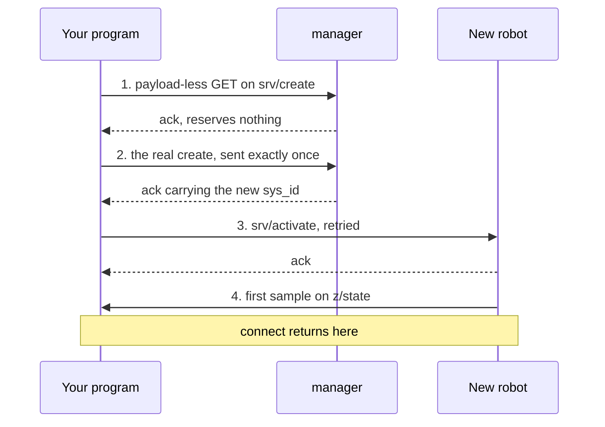

# What connect actually does

The four steps behind a create, why only one of them is sent once, and every option you can change.

## One call, two paths

There is one entry point, and a second that takes options. The two signatures, from
`crates/vrobots-sdk/src/robot.rs`:

```rust
pub fn connect(robot_type: RobotType, sys_id: Option<u32>) -> VrResult<VirtualRobot>

pub fn connect_with(
    robot_type: RobotType,
    sys_id: Option<u32>,
    options: ConnectOptions,
) -> VrResult<VirtualRobot>
```

<details>
<summary>The same in C++ (<code>cpp/include/vrobots_sdk.hpp</code>)</summary>

```cpp
explicit VirtualRobot(RobotType type, std::uint32_t sys_id,
                      const vrsdk_connect_options_t* options = nullptr)

[[nodiscard]] static VirtualRobot create(RobotType type,
                                         const vrsdk_connect_options_t* options = nullptr)

void connect()
```

</details>

<details>
<summary>The same in Python (<code>crates/vrobots-sdk-py/python/vrsdk/_vrsdk.pyi</code>)</summary>

```python
class VirtualRobot:
    def __init__(
        self,
        robot_type: RobotType,
        sys_id: Optional[int] = None,
        *,
        src_id: Optional[int] = None,
        router: Optional[str] = None,
        connect_timeout: Optional[float] = None,
        probe_timeout: Optional[float] = None,
        service_timeout: Optional[float] = None,
        camera_timeout: Optional[float] = None,
        robot_name: Optional[str] = None,
        client_name: Optional[str] = None,
        start_active: Optional[bool] = None,
        activate_after_create: Optional[bool] = None,
        coord_frame_id: Optional[str] = None,
        axis_convention: Optional[int] = None,
    ) -> None: ...
    def connect(self) -> None: ...
```

</details>

The three surfaces split the same work differently. Rust folds construction and connection
into one call and takes options as a second entry point; C++ and Python construct first and
`connect()` second, and neither has a `connect_with` because options ride on construction:
C++ takes a pointer to the C options struct (null for the defaults) and Python takes the
same fields as keyword arguments. C++ also needs a named `create` factory for the `None`
path, because a literal `0` would be ambiguous between "attach to sys_id 0" and a null
options pointer.

`connect` is `connect_with` with `ConnectOptions::default()`. Both open a zenoh
session first, and both end by subscribing the robot's state topic and blocking until
the first snapshot arrives, so `states()` is guaranteed to return real data the
instant `connect` returns. What differs is the middle.

`Some(id)` **attaches**. It never touches `srv/create`, so it works for any robot the
scene contains whatever the spawn catalog says, and the only thing that can go wrong
is that nothing publishes on that id: `VrError::Timeout` after `probe_timeout`.

`None` **creates**, in four steps.

## The four-step create path



**Step 1 is a reachability probe.** A payload-less GET on the create endpoint is
answered `ok = false` and reserves nothing, so it is free to send and free to retry.
It answers one question: is the manager there at all? Without it, a manager that is
absent and a manager that is slow are indistinguishable at the moment it matters.

**Step 2 is the create, sent exactly once.** This is the only non-idempotent service
in the system. The manager allocates an id and spawns a robot for every request that
reaches it, so a retry that lands leaves you with two robots and a handle to one of
them. The SDK therefore sends this one query with no retry loop at all, and a timeout
here is reported rather than papered over. A refusal comes back as `VrError::Service`
carrying the simulator's own message, which lists the catalog: see
[System ids, and the two kinds of robot](03-sys-id.md).

**Step 3 activates, with retry.** `srv/activate` releases a dormant robot's dynamics
hold, and an already-active robot acks and no-ops, so it is idempotent and safe to
re-send. It needs the retry: a robot created a moment ago takes about a second before
zenoh has discovered its `srv/*` queryables, and the first attempt often finds
nobody. This step is skipped when `activate_after_create` is false.

**Step 4 waits for the robot to publish.** An `ok` create reply means the id is
allocated, not that a robot exists in the scene. The SDK waits for the state topic to
produce a sample, so "spawned but never published" fails at `connect` rather than
three lines later at the first `states()` call.

> **Note.** Confirmation is by presence throughout this system, not by
> acknowledgement. `connect` returns when the state topic speaks; `delete` returns
> when it has been silent for a second. The ack in between is a receipt that the
> request arrived. That is [rule two](06-five-rules.md), and it is the same reason
> configuration services are confirmed by measuring the state stream.

## Retry, and the one place it is forbidden

Almost every service in the SDK is queried through a retry loop, because a GET that
finds no responder yet is the normal state of affairs for a second or so after a
robot appears. Two are deliberately excluded.

| Service | Retried | Why |
|---|---|---|
| `srv/create` | no | non-idempotent; every retry that lands spawns another robot |
| `manager/srv/delete` | no | a re-send after success returns a false negative |
| everything else | yes | idempotent; a re-send costs a message |

## `ConnectOptions`

Every timeout, the router endpoint and the identity live in one struct with
documented defaults. It is `#[non_exhaustive]`, so build it with
`ConnectOptions::default()` and chain the `with_*` setters.

| Field | Type | Units | Default | Notes |
|---|---|---|---|---|
| `src_id` | `u32` | n/a | `122` (`DEFAULT_SRC_ID`) | must be non-zero; 0 is reserved for the simulator, and service replies route back by it |
| `router_endpoint` | `Option<String>` | n/a | `None` | `None` uses zenoh peer discovery; set e.g. `tcp/192.168.1.10:7447` for a routed network. Camera streams stay same-host only |
| `connect_timeout` | `Duration` | s | 5 | budget for opening the zenoh session |
| `probe_timeout` | `Duration` | s | 15 | first state sample, and the wait in step 4. Generous because discovery takes seconds after a sim starts |
| `service_timeout` | `Duration` | s | 8 | one GET; doubles as the capability-probe timeout |
| `camera_timeout` | `Duration` | s | 5 | a camera stream appearing on iceoryx2; shorter because there is no discovery to wait out |
| `robot_name` | `Option<String>` | n/a | `None` | wire name for a robot this connection creates; `None` uses the catalog default, and it is ignored when attaching |
| `client_name` | `String` | n/a | `DEFAULT_CLIENT_NAME` | stamps `header.name`, naming *this client* rather than the robot |
| `start_active` | `bool` | n/a | `true` | `false` spawns dormant, for a deterministic configure-then-activate start |
| `activate_after_create` | `bool` | n/a | `true` | harmless when `start_active` is true, required when it is false |
| `coord_frame_id` | `String` | n/a | `"unity"` (`DEFAULT_COORD_FRAME_ID`) | the frame *your* outgoing vectors are in; the robot converts before acting |
| `axis_convention` | `Axes` | n/a | `Axes::UNITY` | the enum tag beside `coord_frame_id`; the string wins if they disagree |

The three most commonly changed, chained. From the doctest on `ConnectOptions` in
`crates/vrobots-sdk/src/options.rs`:

```rust
let opts = ConnectOptions::default()
    .with_router("tcp/192.168.1.10:7447")   // sim on another machine
    .with_src_id(200)                       // second client in the session
    .with_probe_timeout(Duration::from_secs(20));
```

<details>
<summary>The same in C++ (the pattern from <code>examples/cpp/ex30_hello_halfdrone.cpp</code>)</summary>

```cpp
vrsdk_connect_options_t options{};
vrsdk_options_default(&options);
options.service_timeout_s = PROBE_TIMEOUT_S;

vrsdk::VirtualRobot robot(vrsdk::RobotType::HalfDrone, sys_id, &options);
robot.connect();
```

</details>

<details>
<summary>The same in Python (constructor keywords, listed in full above)</summary>

```python
mr = VirtualRobot(
    RobotType.MULTIROTOR,
    sys_id=1,
    router="tcp/192.168.1.10:7447",   # sim on another machine
    src_id=200,                       # second client in the session
    probe_timeout=20.0,
)
```

</details>

The table above is the reference for all three, with two spelling changes. C++ carries the
plain C struct, so the fields are `router_endpoint`, `connect_timeout_s`, `probe_timeout_s`
and so on, and **it must be initialised with `vrsdk_options_default`**: a zeroed struct is
not the defaults, it is every timeout set to zero. Python takes them as keyword arguments,
named without the `_s` suffix, and omitting one means "keep the default" rather than "set it
to zero".

Rust constructs a value and produces no output; the C++ and Python forms above connect with
it.

`src_id` is worth one more sentence. It identifies your traffic, so two clients
sharing a session that both leave it at `122` are indistinguishable in a topic dump,
and a program reading the command bus cannot filter out its own publishes. Give the
second client its own.

**Next:** [Five rules that explain everything](06-five-rules.md)

**See also:** [Robot lifecycle](../ch06-services/01-lifecycle.md), [When nothing happens](../ch01-getting-started/08-troubleshooting.md), [Reading someone else's commands](../ch04-commands/08-reading-commands.md)
