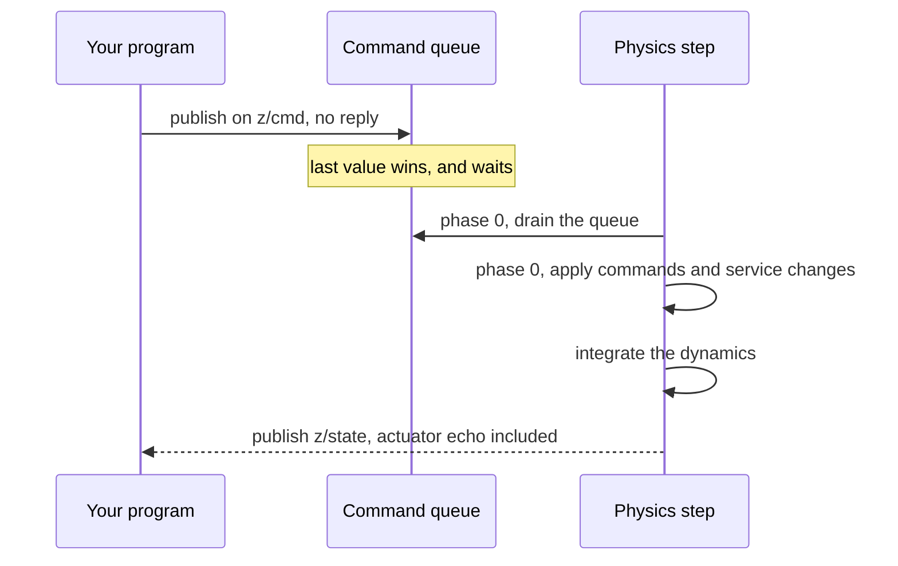

# Five rules that explain everything

The behaviours that account for almost every confused bug report against this SDK.

Every rule below is deliberate, and every one of them has a failure mode that looks
like something else. Learn the detection column and the rest of the book gets easier.

| Rule | The failure looks like | How you detect it |
|---|---|---|
| 1. Commands latch and get no reply | the robot ignores you, or keeps doing the last thing | compare `actuator.pwm` with what you sent |
| 2. An ack is a receipt, not a result | a configuration call succeeded and changed nothing | measure the change in the state stream |
| 3. `states()` never fails | the simulator is running and the numbers are frozen | `wait_new_state`, and `stats().received` |
| 4. Robots outlive the process | a scene fills with robots, or one keeps flying | `vrobots topic list`, and `delete()` |
| 5. Every vector is in the robot's frame | a sign error in altitude, or in a two-robot distance | print `coord_frame_id` beside every vector |

## Rule 1: commands latch and get no reply

**What it means.** Every command is a setpoint, not an impulse. The last one received
stays in effect until the next arrives. There is no watchdog and no expiry, so a
controller that stops sending leaves the robot flying its final command, and a 5 Hz
sender and a 50 Hz sender are equally valid. Nothing is acknowledged: publishing a
command returns as soon as the bytes are queued.

**Why.** A command topic is a bus, not a call. Making it a call would mean the
simulator blocking on each client, and making commands expire would mean a control
loop that stutters becomes a robot that falls out of the sky. Latching is what real
actuator interfaces do.

**How you detect the failure.** The only evidence a command landed is the actuator
echo in the state stream. `actuator.pwm` is your last command echoed back, so a
command that never arrived shows as an echo that never changes. From
`examples/rust/src/bin/ex02_hello_control.rs`:

```rust
let s = robot.states();
let [x, y, z] = s.kin.lin_pos;
println!(
    "State t={:.3} pos=({x:.3},{y:.2},{z:.2}) echo={:?}",
    s.elapsed, s.actuator.pwm
);
```

<details>
<summary>The same in C++ (<code>examples/cpp/ex02_hello_control.cpp</code>)</summary>

```cpp
// The echo: what the robot actually latched, from the state stream.
const std::vector<std::uint32_t> echo = s.pwm();
std::printf("State t=%.3f pos=(%.3f,%.2f,%.2f)  pwm_echo=[", s.elapsed, p[0], p[1],
            p[2]);
for (std::size_t i = 0; i < echo.size(); ++i) {
    std::printf("%s%u", i ? "," : "", echo[i]);
}
```

</details>

<details>
<summary>The same in Python (<code>examples/python/ex02_hello_control.py</code>)</summary>

```python
s = mr.states
x, y, z = s.kin.lin_pos
print(
    f"State t={s.elapsed:.3f} pos=({x:.3f},{y:.2f},{z:.2f}) "
    f"echo={s.actuator.pwm}"
)
```

</details>

Running that prints one line per iteration in which `echo` holds the pulse widths the
robot is currently applying. A wrong `sys_id`, a command the robot does not
implement, and a wrong array length all present identically: the echo does not move.

## Rule 2: an ack is a receipt, not a result

**What it means.** Every `srv/*` reply is packed the instant the request arrives. The
change itself lands in phase 0 of the robot's next physics step, after the reply is
already on its way back to you. `ok = true` therefore means "the request was
received", and nothing more.

**Why.** The service handler runs on the network thread; the change has to run on the
physics thread, at a point in the step where applying it is safe. Waiting for that
before replying would put a physics frame of latency into every service call.

**How you detect the failure.** By measuring, because the ack will not tell you.
**Only `srv/skin` ever answers `ok = false`.** A wrong rotor count, an unknown frame
id, a `drive_mode` that is not 2 or 4: all acked `ok` and refused by a simulator log
line no client can see. The SDK refuses what it can before sending, which is what
every `VrError::InvalidArgument` from a configuration call is. For the rest, read the
state stream back and check the robot behaves differently. That is why the
configuration examples measure rather than assert.

> **Gotcha.** A typo in a skin name on a robot that has a skin catalog is acked `ok`
> and dropped, so it looks exactly like success. Only a tier refusal produces
> `ok = false`. See [Skins](../ch06-services/08-skins.md).

## One physics step, in order

Both rules above are consequences of one sequence. This is what happens between two
state samples:



Physics runs at 50 Hz and state is published at 25 Hz, so a loop faster than 25 Hz
reads the same snapshot more than once, and a loop faster than 50 Hz sends commands
that are overwritten in the queue before anything drains it. Neither is an error.
[Pacing your loop](../ch03-reading-state/07-pacing.md) is where you decide which rate
you actually want.

## Rule 3: `states()` never fails

**What it means.** `states()` never blocks, never returns a half-written value, and
has no error case. An SDK-owned subscriber keeps a snapshot fresh in the background
and `states()` hands you an `Arc` of the most recent one. If the simulator stops, it
keeps returning that last snapshot forever.

**Why.** A control loop that has to handle an error on every sensor read is a control
loop full of error handling. Making the read infallible pushes the one real question,
"is this data still arriving?", to the one place that should ask it.

**How you detect the failure.** With `wait_new_state(timeout)`, which blocks for a
sample newer than the current one and returns `VrError::Timeout` when none comes.
**A timeout is a status, not a failure**: the session is fine and the next call may
well succeed. From `examples/rust/src/bin/ex09_state_paced_loop.rs`:

```rust
Err(VrError::Timeout(detail)) => {
    // Not a broken session: no sample arrived in time. The sim is
    // paused, stopped, or the machine is very busy. states() still
    // returns the last snapshot it had.
    let s = robot.states();
    println!(
        "no new state in {:?} ({detail}); still holding seq={} at t={:.3}",
        TIMEOUT, s.seq, s.elapsed
    );
}
```

<details>
<summary>The same in C++ (<code>examples/cpp/ex09_state_paced_loop.cpp</code>)</summary>

```cpp
try {
    robot.wait_new_state(TIMEOUT_S);
} catch (const vrsdk::Error& e) {
    if (e.code() != VRSDK_ERR_TIMEOUT) {
        throw;  // a real failure
    }
    // Not a broken session: no sample arrived in time. The sim is
    // paused, stopped, or the machine is very busy. states() still
    // returns the last snapshot it had.
    const vrsdk::State s = robot.states();
    std::printf("no new state in %.1fs; still holding seq=%llu at t=%.3f\n", TIMEOUT_S,
                static_cast<unsigned long long>(s.seq), s.elapsed);
    continue;
}
```

</details>

<details>
<summary>The same in Python (<code>examples/python/ex09_state_paced_loop.py</code>)</summary>

```python
try:
    mr.wait_new_state(TIMEOUT)
except vrsdk.VrError as e:
    if e.code != vrsdk.err.TIMEOUT:
        raise  # a real failure
    # Not a broken session: no sample arrived in time. The sim is
    # paused, stopped, or the machine is very busy. `states` still
    # returns the last snapshot it had.
    s = mr.states
    print(
        f"no new state in {TIMEOUT}s ({e.detail}); "
        f"still holding seq={s.seq} at t={s.elapsed:.3f}"
    )
    continue
```

</details>

Rust distinguishes the timeout by matching the `VrError::Timeout` variant. C++ and Python
have one error type each, so they branch on the numeric code and re-raise anything else:
`e.code() != VRSDK_ERR_TIMEOUT` and `e.code != vrsdk.err.TIMEOUT` are the same test, and it
is the same stable number in both.

That arm prints a line each time the simulator goes quiet and keeps the loop alive.
Propagating the timeout out of `main` with `?` instead is what turns a paused
simulator into a crashed program. `stats()` gives the same answer cumulatively:
`received` stops climbing, and `seq_gaps` counts the samples that went missing while
the stream was still up. [Stream health](../ch03-reading-state/08-health.md) covers
both.

## Rule 4: robots outlive the process

**What it means.** A `VirtualRobot` is a handle to something that already existed or
that you asked to be created, and dropping it closes your session and nothing else.
The robot keeps running, keeps publishing, and keeps its last latched command.
Deletion is explicit: only `delete()` removes a robot.

**Why.** The simulator is a persistent world, not a library object. A client that
crashes mid-flight should not take the scene down with it, and a program that attaches
to a scene-authored robot must not be able to delete it by exiting.

**How you detect the failure.** `vrobots topic list` shows every robot that is
publishing. A scene that accumulates robots across runs is a program creating and not
deleting; a robot that keeps moving after your program exits is rule 1 plus rule 4,
and the fix is to send a stop command before returning rather than to hope the drop
does it. `is_deleted()` reports whether this handle's robot was deleted, and a spent
handle returns an error from commands rather than silently doing nothing.

## Rule 5: every vector is in the robot's frame, not yours

**What it means.** Vectors on the wire are expressed in the frame the publisher names
in `coord_frame_id`, and different robots genuinely disagree. Your outgoing headers
carry your own frame (`ConnectOptions::coord_frame_id`, `"unity"` by default) and the
robot converts before acting, but nothing converts what you read.

**Why.** There is no single correct convention. Aerospace wants forward-right-down,
the renderer works in Unity's left-handed frame, and computer vision wants
right-down-forward. Rather than picking one and silently converting, the simulator
tags every message with the frame it used.

**How you detect the failure.** Print `coord_frame_id` next to every vector you print.
The signature is a sign error: an altitude that goes negative as the aircraft climbs,
or a distance between two robots that is wrong in one axis.
`examples/rust/src/bin/ex18_multi_robot.rs` holds two robots whose frames differ and
labels the computed separation as wrong for exactly this reason.
[Frames, axes and units](07-frames-and-units.md) is the full treatment.

## Two more that are almost rules

**Decode errors are counted, not fatal.** A payload that fails to decode does not tear
down the session or interrupt the loop. It increments `stats().decode_errors` and is
retrievable through `last_error()`, and the next sample is handled normally. A stream
that is producing numbers and also producing decode errors is a version-skew symptom,
and it is invisible unless you look at the counters.

**State and camera streams are never paired.** They are independent streams on
independent transports with independent rates, and the SDK does not associate a frame
with a snapshot. Both carry `t_ns` on the same clock, so fusion code compares those
timestamps explicitly and decides for itself what counts as simultaneous.
[Freshness](../ch05-cameras/04-freshness.md) has the mechanics.

**Next:** [Frames, axes and units](07-frames-and-units.md)

**See also:** [Commands latch](../ch04-commands/01-latching.md), [Stream health](../ch03-reading-state/08-health.md), [Robot lifecycle](../ch06-services/01-lifecycle.md), [When nothing happens](../ch01-getting-started/08-troubleshooting.md)
