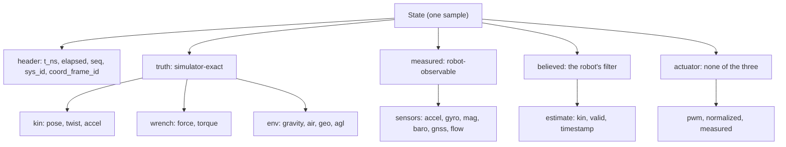

# Reading state

How one state snapshot is put together, and which page of this chapter describes each part of it.

## The snapshot model

The simulator publishes one complete state sample per robot at 25 Hz. The SDK
subscribes in the background, decodes each sample into an owned
[snapshot](../appendix-d-glossary.md) and stores it. You never poll a queue and you
never register a callback: you read the latest snapshot whenever your loop wants it.

That read is the narrowest API in the SDK.

From `crates/vrobots-sdk/src/robot.rs`:

```rust
pub fn states(&self) -> Arc<State> {
    self.channel.snapshot.load_full()
}
```

<details>
<summary>The same in C++ (<code>cpp/include/vrobots_sdk.hpp</code>)</summary>

```cpp
[[nodiscard]] State states() const {
    vrsdk_state_t raw{};
    detail::check(vrsdk_robot_states(require(), &raw), "states");
    return State::from_raw(raw);
}
```

</details>

<details>
<summary>The same in Python (<code>crates/vrobots-sdk-py/python/vrsdk/_vrsdk.pyi</code>)</summary>

```python
class VirtualRobot:
    @property
    def states(self) -> State: ...
```

</details>

The three differ only in how the copy is made and named. Rust hands back a reference-counted
clone, so reading is a pointer bump. C++ copies the C struct into a value you can store and
pass to another thread, and Python builds a `State` object. In Python it is a **property**,
so it is `mr.states` with no parentheses; forgetting that is the most common transcription
error when porting a loop from one of the other two.

This is a signature rather than a program: it returns immediately with the most
recent decoded sample, hands you a reference-counted clone, and cannot fail. A
`State` is a plain owned struct of fixed-size arrays and `Vec`s, with no borrows
into the receive buffer, so it outlives the sample it came from and crosses to C++
and Python as a memory copy.

Three consequences follow, and the rest of the chapter is mostly their detail:

- **A snapshot is never torn.** You either see the previous sample in full or the
  next one in full, never half of each.
- **A snapshot is never absent.** `connect` blocks for the first sample before it
  returns, so `states()` is valid immediately afterwards.
- **A snapshot is never an error.** If the simulator stops, `states()` keeps
  returning the last sample it had, unchanged, forever. Detecting that requires
  [`wait_new_state`](07-pacing.md), not an error check.

## What one snapshot contains

Every sample carries a header, then four blocks that differ in what a real robot
could know about itself.



The split is the schema's whole purpose. `kin`, `wrench` and `env` are values no
physical vehicle could measure. `sensors` is the noisy view of the same instant.
`estimate` is what the robot's own filter believes. `actuator` belongs to none of
them, because it is the command going out and the realised motion coming back.

## The minimal read loop

The smallest useful program takes two fields out of the snapshot and paces itself.

From `examples/rust/src/bin/ex01_hello_states.rs`:

```rust
loop {
    let s = robot.states(); // immutable latest snapshot, never torn
    let [x, y, z] = s.kin.lin_pos;
    println!("State t={:.3} pos=({x:.3},{y:.2},{z:.2})", s.elapsed);
    robot.rate(HZ); // drift-compensated pacing, Hz
}
```

<details>
<summary>The same in C++ (<code>examples/cpp/ex01_hello_states.cpp</code>)</summary>

```cpp
for (;;) {
    const vrsdk::State s = robot.states();  // latest snapshot, never torn
    const double* p = s.kin().lin_pos;
    std::printf("State t=%.3f pos=(%.3f,%.2f,%.2f)\n", s.elapsed, p[0], p[1], p[2]);
    robot.rate(HZ);  // drift-compensated pacing, Hz
}
```

</details>

<details>
<summary>The same in Python (<code>examples/python/ex01_hello_states.py</code>)</summary>

```python
while True:
    s = mr.states  # immutable latest snapshot, never torn
    x, y, z = s.kin.lin_pos
    print(f"State t={s.elapsed:.3f} pos=({x:.3f},{y:.2f},{z:.2f})")
    mr.rate(HZ)  # drift-compensated pacing, Hz
```

</details>

Rust and Python destructure the position into three names; C++ takes a pointer to the
three-element array, because `lin_pos` is a plain C `double[3]` there.

At the example's 50 Hz against a 25 Hz stream, consecutive lines repeat the same
sample about half the time, which is correct and costs nothing:

<!-- VERIFY: printout reconstructed from the format string; the values are illustrative, not captured from a run. -->

```text
State t=12.480 pos=(0.031,0.85,-1.20)
State t=12.480 pos=(0.031,0.85,-1.20)
State t=12.520 pos=(0.032,0.85,-1.21)
```

> **Note.** Reading the same snapshot twice is free and is not a bug. If duplicate
> processing would be a bug, for example when you differentiate or log, pace on the
> data instead: see [Pacing your loop](07-pacing.md).

## The rest of this chapter

| Page | Answers |
|---|---|
| [Truth, measured and believed](01-truth-measured-believed.md) | Which block may a real robot use, and which differences are the experiment |
| [Kinematics](02-kinematics.md) | Pose, twist, acceleration, their frames, and the net wrench |
| [Sensors](03-sensors.md) | Every device, its fields, its units, its own clock |
| [The environment block](04-environment.md) | The truth the sensors were noised from |
| [Actuators](05-actuator.md) | The command echo, and the only proof a command landed |
| [Timestamps and sequence numbers](06-timestamps.md) | Which of the four clocks to use for what |
| [Pacing your loop](07-pacing.md) | Free-running against sample-paced loops |
| [Stream health](08-health.md) | Counters, `last_error`, stalls and restarts |
| [A tour of the whole snapshot](09-sensors-tour.md) | One program that prints all of it at once |

**Next:** [Truth, measured and believed](01-truth-measured-believed.md)

**See also:** [Hello states](../ch01-getting-started/03-hello-states.md), [The shape of a program](../ch02-concepts/04-program-shape.md), [Five rules that explain everything](../ch02-concepts/06-five-rules.md)
