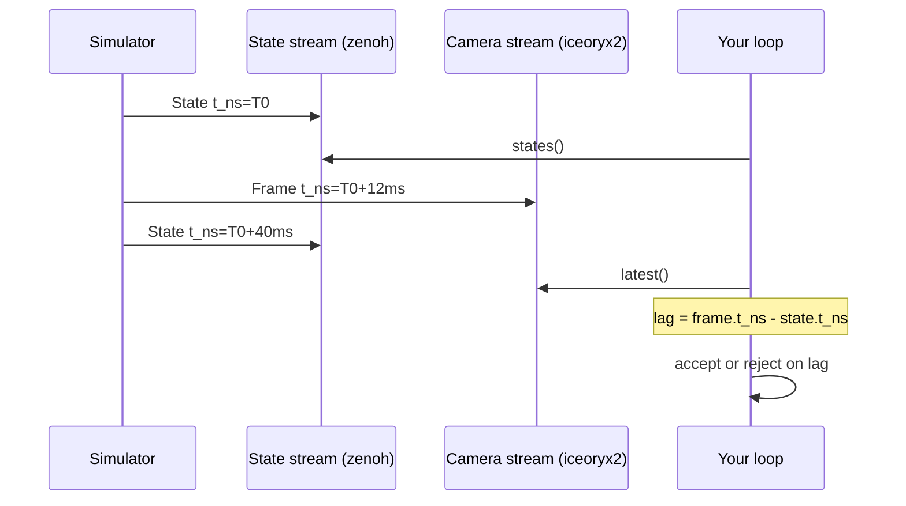

# Timestamps and sequence numbers

The four clocks and one counter that appear in a single snapshot, and which of them to use for which question.

## Why there is more than one

A snapshot is stamped by the simulator at capture time, not by the SDK at read time, so
every time value in it refers to the simulator's clock rather than to your process. Once
you have that, the multiplicity is easy to justify: the header answers "when was this
sample taken", each sensor answers "when did *this device* last produce a reading", and
the estimate answers "how old is the filter's output". They are different questions and
they have different answers on the same sample.

Reach for the right one and most freshness bugs disappear. Reach for the wrong one and
you get code that looks correct and measures nothing.

| Name | Where | Type | Units | Epoch | Use it for |
|---|---|---|---|---|---|
| `t_ns` | snapshot header | `i64` | ns | unix | comparing across streams, including camera frames |
| `elapsed` | snapshot header | `f64` | s | this robot's first state sample | printing, plotting, and reading a log by eye |
| `seq` | snapshot header | `u64` | count | per topic | detecting dropped samples |
| `<sensor>.timestamp` | each sensor block | `f64` | s | unix | detecting whether that device updated |
| `estimate.timestamp` | estimate block | `f64` | s | unix | the age of the filter's output |

`t_ns` is signed, which is deliberate: the useful operation on it is a difference, and a
difference between two independent streams can legitimately be negative.

## Elapsed, and what it does not do

`elapsed` is seconds since this robot's **first** state sample, computed by the decoder
as `(t_ns - epoch_ns) / 1e9`. One epoch is shared by every stream on the robot, so a
state `elapsed` and a camera frame `elapsed` are directly comparable. It is monotonic
for as long as the simulator keeps publishing.

Two properties surprise people. It is not the simulator's run time, because the epoch is
fixed at *your handle's* first sample, not at the simulator's start. And it does not
reset when the simulator restarts: it keeps counting through the outage and comes back
having jumped forward by however long the simulator was away. The robust-loop example
measures exactly that, freezing at 5.84 s for the duration of an outage and resuming at
21.77 s on the first sample of the new run.

> **Note.** `State::decode(bytes, epoch_ns)` exposes the same arithmetic for offline
> use. `epoch_ns` only affects `elapsed`; pass `0` when decoding a standalone recorded
> frame, and the frame's `elapsed` then equals its absolute unix time in seconds.

## Sequence numbers

`seq` is a per-topic counter stamped by the publisher. Consecutive samples differ by
one, so a jump means the samples in between never reached your process. That is the
only ground truth for drops available to a client: a rate measured over a window cannot
distinguish a publisher that slowed down from a network that dropped every third
sample.

The sample-paced example computes both the wall gap and the skip count on each wakeup.

From `examples/rust/src/bin/ex09_state_paced_loop.rs`:

```rust
let s = robot.states();
let dt_ms = if last_t_ns == 0 {
    f64::NAN
} else {
    (s.t_ns - last_t_ns) as f64 / 1e6
};
let skipped = s.seq.saturating_sub(last_seq + 1);
last_seq = s.seq;
last_t_ns = s.t_ns;
```

<details>
<summary>The same in C++ (<code>examples/cpp/ex09_state_paced_loop.cpp</code>)</summary>

```cpp
// Exactly one new sample is waiting -- read it and do the work.
const vrsdk::State s = robot.states();
const double dt_ms =
    last_t_ns == 0 ? 0.0 : static_cast<double>(s.t_ns - last_t_ns) / 1e6;
const std::uint64_t skipped = s.seq > last_seq + 1 ? s.seq - last_seq - 1 : 0;
last_seq = s.seq;
last_t_ns = s.t_ns;
```

</details>

<details>
<summary>The same in Python (<code>examples/python/ex09_state_paced_loop.py</code>)</summary>

```python
# Exactly one new sample is waiting -- read it and do the work.
s = mr.states
dt_ms = float("nan") if last_t_ns == 0 else (s.t_ns - last_t_ns) / 1e6
skipped = max(0, s.seq - (last_seq + 1))
last_seq, last_t_ns = s.seq, s.t_ns
```

</details>

`t_ns` is a signed 64-bit integer of nanoseconds and `seq` an unsigned 64-bit counter in all
three, so the arithmetic is the same everywhere. Only the guard against the first iteration
differs: Rust and Python use a NaN sentinel for the unknown first `dt`, C++ prints zero.

At a healthy 25 Hz the interval sits near 40 ms and `skipped` stays zero; a drop shows
as a doubled interval and a non-zero skip on the same line:

<!-- VERIFY: printout reconstructed from the format string; the values are illustrative, not captured from a run. -->

```text
seq=310 dt=  40.0 ms pos=(0.031,0.85,-1.20)
seq=311 dt=  40.1 ms pos=(0.031,0.85,-1.20)
seq=313 dt=  80.0 ms pos=(0.032,0.85,-1.21)  <- 1 sample(s) skipped
```

`seq` restarting from zero is not a drop. It means the publisher restarted, and the SDK
recognises it as such: see [Stream health](08-health.md).

## Two streams, one clock

State arrives over zenoh and camera frames arrive over iceoryx2. They are independent
streams with independent rates, and **the SDK never pairs them**. There is no combined
callback, no synchronised read and no interpolation.



What makes the pairing possible at all is that both stamps are on the same clock:
`Frame::t_ns` and `State::t_ns` are both simulator capture times in unix nanoseconds and
are directly subtractable, and `Frame::elapsed` shares the state stream's epoch.

The fusion rule follows from that in one line: **compare `t_ns` explicitly, decide a
tolerance, and reject the pair when the lag exceeds it.** A frame and a state sample
that merely arrived near each other in your process are not simultaneous, because
arrival order reflects transport and scheduling rather than capture time. Chapter 5
gives the freshness patterns in full.

## Choosing between them

| Question | Field |
|---|---|
| How far apart in time were these two samples | `t_ns` |
| Did I lose any samples | `seq` |
| What do I put on the x axis of a plot | `elapsed` |
| Is this GNSS fix the same one I already used | `sensors.gnss.timestamp` |
| Is the filter output stale | `estimate.timestamp`, and `estimate.valid` first |
| Does this camera frame belong with this state | `Frame::t_ns` minus `State::t_ns` |

**Next:** [Pacing your loop](07-pacing.md)

**See also:** [Freshness](../ch05-cameras/04-freshness.md), [Stream health](08-health.md), [Measuring rates](../ch08-tooling/05-rates.md)
