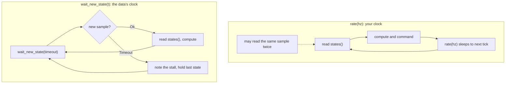

# Pacing your loop

The two ways to decide how often your loop body runs, and how to pick between them.

```sh
cargo run -p vrobots-examples --bin ex09_state_paced_loop
./target/cpp-build/ex09_state_paced_loop
python examples/python/ex09_state_paced_loop.py
```

## Your clock or the data's clock

`main` owns the loop, so something in the body has to decide when the next iteration
starts. The SDK offers two answers and they are not interchangeable.

`rate(hz)` sleeps until your next tick, with drift compensation, and then returns. Your
clock drives the loop. `states()` hands back whatever the latest snapshot is at that
moment, which at a tick rate above the 25 Hz stream means the same sample twice and at a
tick rate below it means samples you never look at.

`wait_new_state(timeout)` blocks until a snapshot newer than the one you have arrives.
The data drives the loop, so the body runs once per published sample: no duplicates, no
skips, and no need to guess a rate that divides 25 Hz.



Both signatures come from the same handle.

From `crates/vrobots-sdk/src/robot.rs`:

```rust
pub fn wait_new_state(&self, timeout: Duration) -> VrResult<()> {
```

<details>
<summary>The same in C++ (<code>cpp/include/vrobots_sdk.hpp</code>)</summary>

```cpp
void wait_new_state(double timeout_s = 0.2)

void rate(double hz)
```

</details>

<details>
<summary>The same in Python (<code>crates/vrobots-sdk-py/python/vrsdk/_vrsdk.pyi</code>)</summary>

```python
def wait_new_state(self, timeout: float = 0.2) -> None: ...
def rate(self, hz: float) -> None: ...
```

</details>

Rust takes a `Duration`; C++ and Python take seconds as a plain `double`, and both default it
to 0.2. Neither returns the sample in any of the three, so `states()` is still the read.

The call returns `Ok(())` once a newer sample is available, at which point you still
read it with `states()`. It does not hand you the sample, which keeps the read path
identical in both styles.

## A timeout is a status, not an error

`VrError::Timeout` from `wait_new_state` means "no new sample arrived in time". The
session is healthy, the subscriber is intact, and the next call may well succeed. A
paused simulator, a stopped simulator and a very busy machine all announce themselves
this way, and none of them is a reason to exit.

Propagating that error out of `main` with `?` is the single most common way to turn a
paused simulator into a crashed program. Match on it instead, and let every other
variant be fatal.

From `examples/rust/src/bin/ex09_state_paced_loop.rs`:

```rust
loop {
    match robot.wait_new_state(TIMEOUT) {
        Ok(()) => {
            // Exactly one new sample is waiting -- read it and do the work.
            let s = robot.states();
            let dt_ms = if last_t_ns == 0 {
                f64::NAN
            } else {
                (s.t_ns - last_t_ns) as f64 / 1e6
            };
            let skipped = s.seq.saturating_sub(last_seq + 1);
            last_seq = s.seq;
            last_t_ns = s.t_ns;

            let [x, y, z] = s.kin.lin_pos;
            println!(
                "seq={} dt={dt_ms:6.1} ms pos=({x:.3},{y:.2},{z:.2}){}",
                s.seq,
                if skipped > 0 {
                    format!("  <- {skipped} sample(s) skipped")
                } else {
                    String::new()
                }
            );
        }
        Err(VrError::Timeout(detail)) => {
            // Not a broken session: no sample arrived in time. The sim is
            // paused, stopped, or the machine is very busy. states() still
            // returns the last snapshot it had.
            let s = robot.states();
            println!(
                "no new state in {:?} ({detail}); still holding seq={} at t={:.3}",
                TIMEOUT, s.seq, s.elapsed
            );
        }
        Err(other) => return Err(other), // a real failure
    }
}
```

<details>
<summary>The same in C++ (<code>examples/cpp/ex09_state_paced_loop.cpp</code>)</summary>

```cpp
for (;;) {
    try {
        robot.wait_new_state(TIMEOUT_S);
    } catch (const vrsdk::Error& e) {
        if (e.code() != VRSDK_ERR_TIMEOUT) {
            throw;  // a real failure
        }
        // Not a broken session: no sample arrived in time. The sim is
        // paused, stopped, or the machine is very busy. states() still
        // returns the last snapshot it had.
        const vrsdk::State s = robot.states();
        std::printf("no new state in %.1fs; still holding seq=%llu at t=%.3f\n", TIMEOUT_S,
                    static_cast<unsigned long long>(s.seq), s.elapsed);
        continue;
    }

    // Exactly one new sample is waiting -- read it and do the work.
    const vrsdk::State s = robot.states();
    const double dt_ms =
        last_t_ns == 0 ? 0.0 : static_cast<double>(s.t_ns - last_t_ns) / 1e6;
    const std::uint64_t skipped = s.seq > last_seq + 1 ? s.seq - last_seq - 1 : 0;
    last_seq = s.seq;
    last_t_ns = s.t_ns;

    const double* p = s.kin().lin_pos;
    std::printf("seq=%llu dt=%6.1f ms pos=(%.3f,%.2f,%.2f)",
                static_cast<unsigned long long>(s.seq), dt_ms, p[0], p[1], p[2]);
    if (skipped > 0) {
        std::printf("  <- %llu sample(s) skipped", static_cast<unsigned long long>(skipped));
    }
    std::printf("\n");
}
```

</details>

<details>
<summary>The same in Python (<code>examples/python/ex09_state_paced_loop.py</code>)</summary>

```python
while True:
    try:
        mr.wait_new_state(TIMEOUT)
    except vrsdk.VrError as e:
        if e.code != vrsdk.err.TIMEOUT:
            raise  # a real failure
        # Not a broken session: no sample arrived in time. The sim is
        # paused, stopped, or the machine is very busy. `states` still
        # returns the last snapshot it had.
        s = mr.states
        print(
            f"no new state in {TIMEOUT}s ({e.detail}); "
            f"still holding seq={s.seq} at t={s.elapsed:.3f}"
        )
        continue

    # Exactly one new sample is waiting -- read it and do the work.
    s = mr.states
    dt_ms = float("nan") if last_t_ns == 0 else (s.t_ns - last_t_ns) / 1e6
    skipped = max(0, s.seq - (last_seq + 1))
    last_seq, last_t_ns = s.seq, s.t_ns

    x, y, z = s.kin.lin_pos
    note = f"  <- {skipped} sample(s) skipped" if skipped else ""
    print(f"seq={s.seq} dt={dt_ms:6.1f} ms pos=({x:.3f},{y:.2f},{z:.2f}){note}")
```

</details>

Rust's `match` puts the two outcomes side by side; C++ and Python invert it, catching the
timeout, re-raising everything else, and falling through to the work. The `continue` in the
timeout arm is what keeps the shape equivalent: a caught timeout must not run the read
below it.

Pausing the simulator while this runs switches the output from one line per sample to
one line per timeout, and unpausing it switches back without a reconnect:

<!-- VERIFY: printout reconstructed from the format strings; the values are illustrative, not captured from a run. -->

```text
seq=310 dt=  40.0 ms pos=(0.031,0.85,-1.20)
seq=311 dt=  40.1 ms pos=(0.031,0.85,-1.20)
no new state in 200ms (no new state within 200ms (sys_id 1)); still holding seq=311 at t=12.440
no new state in 200ms (no new state within 200ms (sys_id 1)); still holding seq=311 at t=12.440
seq=312 dt=1240.3 ms pos=(0.031,0.85,-1.20)
```

The example sets `TIMEOUT` to 200 ms, five times the 25 Hz period. That is the useful
shape for a timeout: long enough that ordinary jitter never trips it, short enough that
a stall is noticed within a human's patience.

> **Gotcha.** `wait_new_state` guarantees that the sample is newer, not that it is the
> next one. The SDK stores the newest sample received, so if two arrive between wakeups
> you see the second and `seq` jumps by two. That is why the example computes `skipped`
> from `seq` rather than assuming one iteration equals one sample.

## Choosing

| Your loop | Use | Because |
|---|---|---|
| a controller emitting a setpoint on a schedule | `rate(hz)` | the output must be periodic whatever the sensor did |
| a controller running faster than 25 Hz | `rate(hz)` | duplicate reads are free and the schedule is what matters |
| logging every sample once | `wait_new_state` | a duplicated or missed row is a corrupt log |
| numerical differentiation or a filter | `wait_new_state` | processing a sample twice gives a zero derivative and a wrong state |
| watching for the simulator to stall | `wait_new_state` | it is the only call that reports the absence of data |
| a one-shot script | neither | do the request, print, exit |

The two styles compose. A controller can run on `rate(hz)` and still call
`wait_new_state` with a short timeout once a second to check that the stream is alive,
which is the pattern [Stream health](08-health.md) builds on.

> **Note.** `rate(hz)` is drift-compensated: its deadlines are absolute multiples of the
> period counted from the first call, not `now + period`, so the time your loop body
> spends working does not accumulate as a slow drift. An iteration that overruns its
> budget re-anchors to the present rather than firing a burst of zero-length sleeps to
> catch up. It is also deliberately infallible, so it needs no `?` on the hot path: a
> non-finite or non-positive `hz` returns immediately with a warning instead of
> panicking.

**Next:** [Stream health](08-health.md)

**See also:** [Timestamps and sequence numbers](06-timestamps.md), [The shape of a program](../ch02-concepts/04-program-shape.md), [Measuring rates](../ch08-tooling/05-rates.md)
