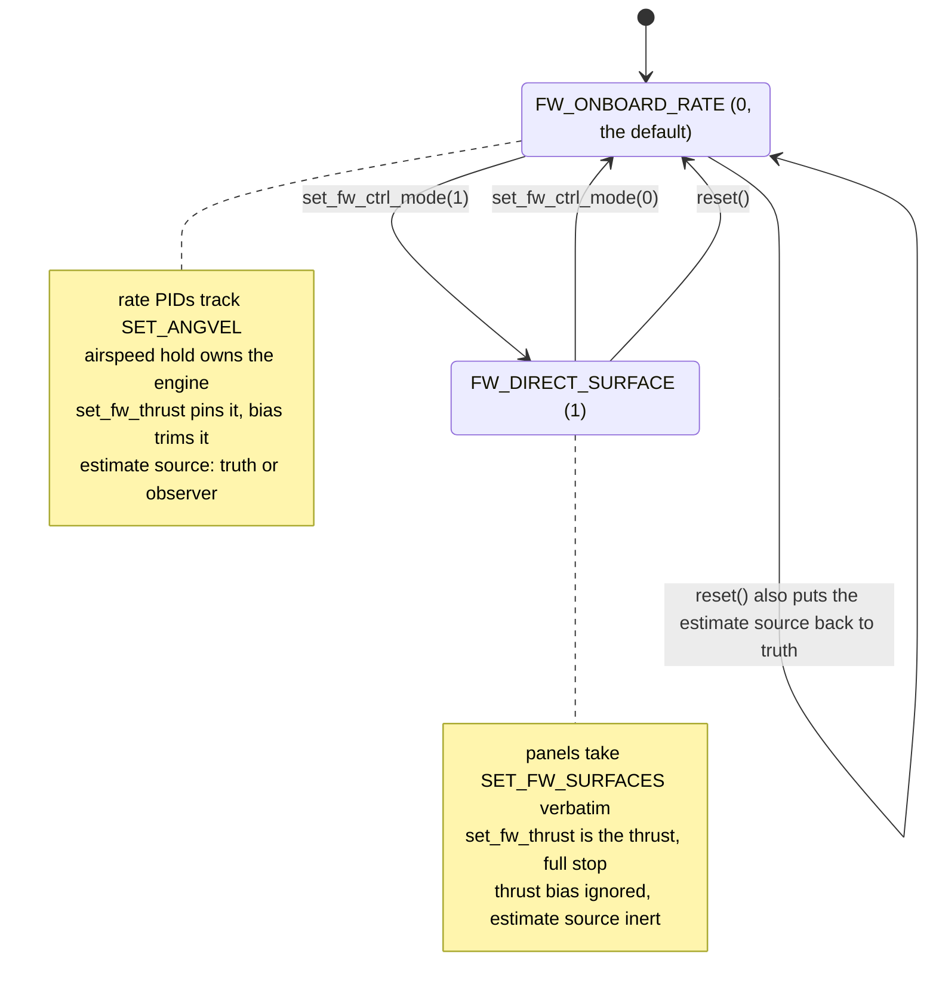

# Fixed wing control

The RQ-4B Global Hawk flies itself unless you take it, and five commands decide who is
flying and what the airframe does.

```sh
cargo run -p vrobots-examples --bin ex31_globalhawk_direct -- <sys_id>
./target/cpp-build/ex31_globalhawk_direct <sys_id>
python examples/python/ex31_globalhawk_direct.py <sys_id>
cargo run -p vrobots-examples --bin ex33_fw_est_source -- <sys_id>
./target/cpp-build/ex33_fw_est_source <sys_id>
python examples/python/ex33_fw_est_source.py <sys_id>
```

The Global Hawk is scene-authored and lives in the IMU scene, not the sandbox, so both
examples take the live `sys_id` as an argument. Find it with `cargo run -p vrobots-sdk
--bin vrobots -- topic list`.

## Two modes, and what reset does to them



Left alone the aircraft cruises at 72.8 m/s under the onboard rate loop plus airspeed hold
and needs nothing from you. Transitions in both directions are bumpless on the simulator's
side, so there is no need to ramp in or out.

## The five commands

| Method | Signature | Command | Units and range | Acted on in |
|---|---|---|---|---|
| `set_fw_ctrl_mode` | `(&self, mode: i32) -> VrResult<()>` | `SET_FW_CTRL_MODE` (310) | 0 or 1; anything else is `InvalidArgument` | both |
| `set_fw_surfaces` | `(&self, radians: &[f64]) -> VrResult<()>` | `SET_FW_SURFACES` (307) | radians, one per panel, clamped to the airframe's 20 degree limit | direct only; latched but unused in onboard |
| `set_fw_thrust` | `(&self, newtons: f64) -> VrResult<()>` | `SET_FW_THRUST` (308) | newtons, clamped to `[0, max_thrust]`, 20 kN on the RQ-4B | both |
| `set_fw_thrust_bias` | `(&self, newtons: f64) -> VrResult<()>` | `SET_FW_THRUST_BIAS` (309) | newtons, signed trim; `0.0` is neutral | onboard only |
| `set_fw_est_source` | `(&self, source: i32) -> VrResult<()>` | `SET_FW_EST_SOURCE` (311) | 0 or 1; anything else is `InvalidArgument` | onboard only |

The rate setpoint is a sixth command, and it is not a `SET_FW_*` id: it is `SET_ANGVEL`
(51), shared across the whole id space with the fixed wing as the only type that acts on
it. `set_angvel(&self, rates: [f64; 3]) -> VrResult<()>` is its typed method. The triple is
`[p, q, r]` in rad/s in your header frame, and the robot re-expresses it as an **axial**
vector, so a conversion between two opposite-handed conventions flips its sign where a
force's would not.

## Six panels, no mixer

Each entry of `set_fw_surfaces` drives its own panel. Turning roll, pitch and yaw demands
into deflections is your job.

| Index | Panel | What the onboard mixer does with it |
|---|---|---|
| 0 | left outboard flap | aileron, gain +1 |
| 1 | right outboard flap | aileron, gain -1 |
| 2 | left inner flap | nothing, gain 0 on all three channels |
| 3 | right inner flap | nothing |
| 4 | rear left ruddervator | elevator -1, rudder +1 |
| 5 | rear right ruddervator | elevator -1, rudder -1 |

Indices 2 and 3 are how you prove direct mode took: the simulator's own mixer has zero gain
there and can never move them, so an inner flap that follows your command could only have
come through the per-panel path.

The length must equal the panel count exactly. A wrong-length array makes the simulator
drop the **whole** command, never apply it partially, and the previously latched
deflections stay in effect. Client-side the SDK checks only that the slice is non-empty and
that every value is finite.

## The echo is in radians and newtons

`actuator.measured` has panels plus one entries:

```text
measured[0..=5]  per-panel deflection, RADIANS
measured[6]      the engine, NEWTONS -- not normalised, not a pulse width
```

A simulator too old for the per-panel path publishes six entries rather than seven, so the
channel count is the version check. `examples/rust/src/bin/ex32_fw_rate_controller.rs`
refuses to run against one:

```rust
    let channels = robot.states().actuator.measured.len();
    if channels != PANELS + 1 {
        return Err(VrError::InvalidArgument(format!(
            "this robot publishes {channels} actuator channels; this mixer is written for \
             {PANELS} panels + an engine. Six channels means a simulator too old for the \
             per-panel path."
        )));
    }
```

<details>
<summary>The same in C++ (<code>examples/cpp/ex32_fw_rate_controller.cpp</code>)</summary>

```cpp
const std::uint32_t channels = robot.states().actuator().measured_count;
if (channels != PANELS + 1) {
    std::fprintf(stderr,
                 "this robot publishes %u actuator channels; this mixer is written for "
                 "%zu panels + an engine. Six channels means a simulator too old for the "
                 "per-panel path.\n",
                 channels, PANELS);
    return 1;
}
```

</details>

<details>
<summary>The same in Python (<code>examples/python/ex32_fw_rate_controller.py</code>)</summary>

```python
channels = len(robot.states.actuator.measured)
if channels != PANELS + 1:
    raise SystemExit(
        f"this robot publishes {channels} actuator channels; this mixer is "
        f"written for {PANELS} panels + an engine. Six channels means a "
        f"simulator too old for the per-panel path."
    )
```

</details>

The count comes off a length in Rust and Python and off `measured_count` in C++, which is
the same number: the C struct carries a fixed-size array plus its used length.

The check runs once, before the aircraft is touched, so an old simulator produces a named
error at startup instead of a mixer that appears to do nothing.

## Bumpless is not zeroed

Entering a mode seeds the latches from what the plant is doing now, including whatever
thrust the airspeed hold happened to be carrying. Nothing jolts, and nothing is cleared
either. A client that wants a particular thrust must send it after **every** mode entry.
That is why the order in `examples/rust/src/bin/ex31_globalhawk_direct.rs` is mode first,
thrust second:

```rust
    robot.set_fw_ctrl_mode(cmd::FW_DIRECT_SURFACE)?;
    robot.set_fw_thrust(CRUISE_N)?;
    println!("\nmode -> DIRECT_SURFACE, thrust -> {CRUISE_N} N\n");
```

<details>
<summary>The same in C++ (<code>examples/cpp/ex31_globalhawk_direct.cpp</code>)</summary>

```cpp
// -- so the thrust command has to come AFTER the mode, every time.
robot.set_fw_ctrl_mode(vrsdk::FwCtrlMode::DirectSurface);
robot.set_fw_thrust(CRUISE_N);
std::printf("\nmode -> DIRECT_SURFACE, thrust -> %.0f N\n\n", CRUISE_N);
```

</details>

<details>
<summary>The same in Python (<code>examples/python/ex31_globalhawk_direct.py</code>)</summary>

```python
# so the thrust command has to come AFTER the mode, every time.
robot.set_fw_ctrl_mode(cmd.FW_DIRECT_SURFACE)
robot.set_fw_thrust(CRUISE_N)
print(f"\nmode -> DIRECT_SURFACE, thrust -> {CRUISE_N} N\n")
```

</details>

Only the spelling of the mode differs. C++ has a real `enum class`, `vrsdk::FwCtrlMode`, so
the argument is `FwCtrlMode::DirectSurface`; Rust and Python pass the integer constant from
`cmd`. The wire value is the same in all three.

```text
mode -> DIRECT_SURFACE, thrust -> 3800 N
```

Skip the thrust line and the engine keeps whatever the autopilot left, which is usually
about 3.8 kN at trim. That is a plausible-looking number, which is what makes the omission
hard to spot.

In onboard mode `set_fw_thrust` means something slightly different: it takes the engine off
airspeed hold and pins it, and it clears any thrust bias. The two overrides are
last-writer-wins, and `set_fw_thrust_bias(0.0)` is the release back to plain airspeed hold.

## What reset takes away

`reset()` reverts the control mode to `FW_ONBOARD_RATE` **and** the estimate source to
`FW_EST_TRUTH`, and relaunches the aircraft at trim airspeed. This is deliberate: keeping
direct control with the surface latches zeroed would relaunch the aircraft unflyable.

> **Gotcha.** After a reset your surface commands are still publishing, still returning
> `Ok(())`, and doing nothing at all, because the mixer is flying the panels again. The
> symptom is the inner flaps sitting at 0 while the same command streams. Re-assert
> `set_fw_ctrl_mode`, then re-assert `set_fw_thrust`, in that order, after every reset.

## Feeding the loop your own estimate

`set_fw_est_source` decides which attitude the onboard rate loop believes. The controller
itself never knows which, because the swap happens upstream of it in the robot, which is
exactly how a real flight computer gets fooled.

| Constant | Value | The onboard loop is fed |
|---|---|---|
| `cmd::FW_EST_TRUTH` | 0 | the simulator's true attitude; the default |
| `cmd::FW_EST_OBSERVER` | 1 | whatever is published on the robot's `z/estimate` topic |

From `examples/rust/src/bin/ex33_fw_est_source.rs`, selecting the observer with nothing
publishing an estimate:

```rust
    robot.set_fw_est_source(cmd::FW_EST_OBSERVER)?;
    println!(
        "\nsource -> OBSERVER. Nothing publishes z/estimate here, so within 0.5 s \
         the estimate is stale and the loop is fed truth again -- the simulator \
         logs a warning saying exactly that."
    );
```

<details>
<summary>The same in C++ (<code>examples/cpp/ex33_fw_est_source.cpp</code>)</summary>

```cpp
// ===== phase 2: observer, with nobody publishing an estimate =====
robot.set_fw_est_source(vrsdk::FwEstSource::Observer);
std::printf(
    "\nsource -> OBSERVER. Nothing publishes z/estimate here, so within 0.5 s the "
    "estimate is stale and the loop is fed truth again -- the simulator logs a warning "
    "saying exactly that.\n");
```

</details>

<details>
<summary>The same in Python (<code>examples/python/ex33_fw_est_source.py</code>)</summary>

```python
# ===== phase 2: observer, with nobody publishing an estimate =====
robot.set_fw_est_source(cmd.FW_EST_OBSERVER)
print(
    "\nsource -> OBSERVER. Nothing publishes z/estimate here, so within 0.5 s "
    "the estimate is stale and the loop is fed truth again -- the simulator "
    "logs a warning saying exactly that."
)
```

</details>

Again C++ has the typed `vrsdk::FwEstSource` where the other two pass `cmd::FW_EST_OBSERVER`
and `cmd.FW_EST_OBSERVER`.

The run ends with one line per phase:

```text
steady yaw-rate tracking, commanded 0.05 rad/s:
  truth (source 0)                   mean r=<rad/s>  mean error=<rad/s>  |error|=<rad/s>
  observer (source 1), no publisher  mean r=<rad/s>  mean error=<rad/s>  |error|=<rad/s>
  after reset                        mean r=<rad/s>  mean error=<rad/s>  |error|=<rad/s>
```

The example measures yaw-rate tracking error across those three phases, and phase 2
matching phase 1 is the whole result: the loop asked for an estimate, found none fresh, and kept
flying on truth.

> **Gotcha.** An estimate older than 0.5 s is treated as stale and the loop silently falls
> back to truth. From the client there is no field that says which source is live, so an
> estimator publishing at 1 Hz behaves like one that is not publishing at all, and the only
> difference you can measure is that the tracking error stops changing.

This page is only the selector. The other half is `publish_estimate`, which puts a
`swarmbotix.states.EstimateState` on `vrobots/{sys_id}/z/estimate` for `FW_EST_OBSERVER` to
find, and `examples/rust/src/bin/ex35_publish_estimate.rs` is the paired publisher: it
flies the same aircraft on a truth copy of its own attitude, then on a copy pitched up five
degrees, and the airframe trims down to chase a nose position that was never real.
[Publishing estimates](09-publishing-estimates.md) is that side in full, including the
half-second staleness clock from the publisher's end.

**Next:** [The generic command](06-generic-cmd.md)

**See also:** [Publishing estimates](09-publishing-estimates.md), [Commands latch](01-latching.md), [Reading someone else's commands](08-reading-commands.md), [Global Hawk](../ch07-robots/06-globalhawk.md)
