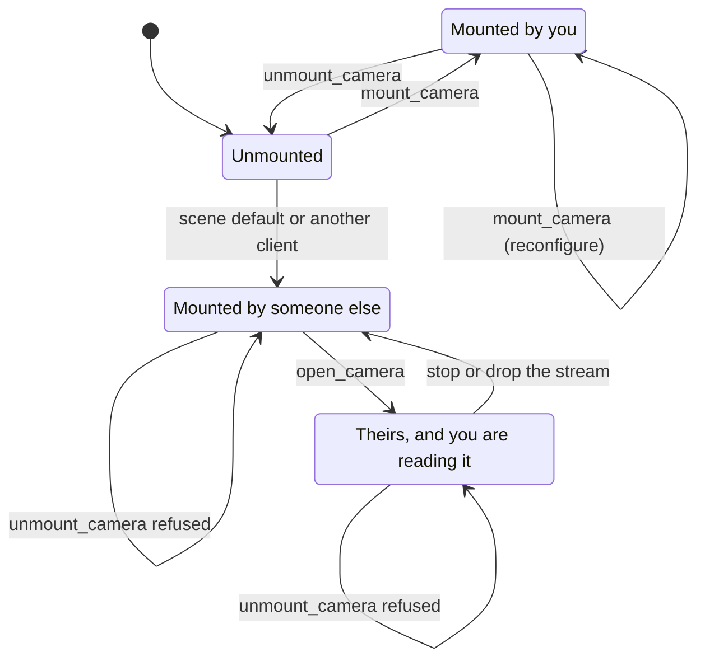

# Mount, open and unmount

Three verbs with three different effects on the simulator, only one of which changes anything.

```sh
cargo run -p vrobots-examples --bin ex03_hello_image
./target/cpp-build/ex03_hello_image
python examples/python/ex03_hello_image.py
cargo run -p vrobots-examples --bin ex13_open_camera
./target/cpp-build/ex13_open_camera
python examples/python/ex13_open_camera.py
```

## The three verbs

| Verb | Mutates the simulator | Needs the camera to exist first | Can it undo itself |
|---|---|---|---|
| `mount_camera` / `mount_camera_with` | yes, `srv/cameras` | no, it creates the camera | yes, with `unmount_camera` |
| `open_camera` | no, subscribe only | yes, exactly this name, resolution and format | nothing to undo |
| `unmount_camera` | yes, `srv/cameras` | it must be one this handle mounted | it is the undo |

The signatures, from `crates/vrobots-sdk/src/robot.rs`:

```rust
fn mount_camera(&self, name: &str, resolution: &str, format: &str) -> VrResult<CameraStream>
fn mount_camera_with(&self, name: &str, resolution: &str, format: &str, options: &CameraOptions) -> VrResult<CameraStream>
fn open_camera(&self, name: &str, resolution: &str, format: &str) -> VrResult<CameraStream>
fn unmount_camera(&self, name: &str) -> VrResult<()>
fn mounted_cameras(&self) -> Vec<CameraSpec>
```

<details>
<summary>The same in C++ (<code>cpp/include/vrobots_sdk.hpp</code>)</summary>

```cpp
[[nodiscard]] CameraStream mount_camera(const std::string& name,
                                        const std::string& resolution = "720p",
                                        const std::string& format = "rgb8",
                                        const vrsdk_camera_options_t* options = nullptr)
[[nodiscard]] CameraStream open_camera(const std::string& name,
                                       const std::string& resolution = "720p",
                                       const std::string& format = "rgb8")
void unmount_camera(const std::string& name)
[[nodiscard]] std::vector<std::array<std::string, 3>> mounted_cameras() const
```

</details>

<details>
<summary>The same in Python (<code>crates/vrobots-sdk-py/python/vrsdk/_vrsdk.pyi</code>)</summary>

```python
def mount_camera(
    self,
    name: str,
    resolution: str = "720p",
    format: str = "rgb8",
    *,
    mount_position: Optional[Sequence[float]] = None,
    mount_euler_deg: Optional[Sequence[float]] = None,
    fx: Optional[float] = None,
    fy: Optional[float] = None,
    near_clip: Optional[float] = None,
    far_clip: Optional[float] = None,
) -> CameraStream: ...
def open_camera(
    self, name: str, resolution: str = "720p", format: str = "rgb8"
) -> CameraStream: ...
def unmount_camera(self, name: str) -> None: ...
def mounted_cameras(self) -> list[CameraSpec]: ...
```

</details>

Four verbs in Rust, three in the bindings: `mount_camera_with` has no counterpart, because
C++ takes the options as an optional fourth argument and Python takes them as keyword-only
arguments. C++ also has no `CameraSpec` type, so `mounted_cameras` gives back
`{name, resolution, format}` as a three-element array of strings. Everything else, including
the defaults of `"720p"` and `"rgb8"`, matches across the three.

The two `mount_*` calls and `unmount_camera` reach the robot's `srv/cameras`; `open_camera`
opens a subscriber, and `mounted_cameras` never leaves the process.

## The lifecycle

A camera is either on the robot or not, and a camera that is on the robot was put there by
this handle, by another client, or by the scene. Those three cases behave differently, and
the difference is the whole page.



`Opened` is a state of your subscription, not of the camera: the camera itself does not
notice that you attached, and it keeps publishing for everyone when you drop the stream.

## Mounting adds exactly one camera

`mount_camera` is an **upsert of one camera**. The request names that camera and asks the
simulator to add it, or to reconfigure it if the name is already there. Every other camera
on the robot is left exactly as it was: the scene's own cameras, another client's cameras,
ones you attached with `open_camera`. Their streams do not blip.

Mounting a name that is already mounted reconfigures it, and if the resolution or format
changes then the stream name changes with it, so the old stream ends and a new one begins.
Anything still holding the old handle is reading a service that no longer exists.

From `examples/rust/src/bin/ex03_hello_image.rs`, the whole of mounting:

```rust
let robot = VirtualRobot::connect(RobotType::Multirotor, Some(SYS_ID))?;

// mount_camera CREATES the camera on the robot (srv/cameras) and subscribes
// to its iox2 stream. Use open_camera(...) to subscribe to an existing one
// without mutating the sim.
let cam = robot.mount_camera(CAMERA, RESOLUTION, FORMAT)?;
println!("camera stream: {}", cam.service_name());
```

<details>
<summary>The same in C++ (<code>examples/cpp/ex03_hello_image.cpp</code>)</summary>

```cpp
vrsdk::VirtualRobot robot(vrsdk::RobotType::Multirotor, SYS_ID);
robot.connect();

// mount_camera CREATES the camera on the robot (srv/cameras) and
// subscribes to its iox2 stream. Use open_camera(...) to subscribe to an
// existing one without mutating the sim.
vrsdk::CameraStream cam = robot.mount_camera(CAMERA, RESOLUTION, FORMAT);
std::printf("camera stream: %s\n", cam.service_name().c_str());
```

</details>

<details>
<summary>The same in Python (<code>examples/python/ex03_hello_image.py</code>)</summary>

```python
mr = VirtualRobot(RobotType.MULTIROTOR, sys_id=SYS_ID)
mr.connect()

# mount_camera CREATES the camera on the robot (srv/cameras) and subscribes
# to its iox2 stream. Use open_camera(...) to subscribe to an existing one
# without mutating the sim.
cam = mr.mount_camera(CAMERA, RESOLUTION, FORMAT)
print(f"camera stream: {cam.service_name}")
```

</details>

`service_name` is a method in Rust and C++ and a property in Python, and it reports the same
string in all three.

With `SYS_ID = 1`, `CAMERA = "left"`, `RESOLUTION = "720p"` and `FORMAT = "rgb8"`, that
prints the iceoryx2 service name, which is what `vrobots topic list` shows for the same
stream:

```text
camera stream: vrobots/1/i/cam/left/720p_rgb8
```

The ack from `srv/cameras` is a receipt, not a result. The confirmation that the camera
exists is the stream appearing, which is what `mount_camera` waits for before it returns.

## Opening changes nothing

`open_camera` opens the iceoryx2 subscriber and touches the simulator not at all. Two
processes can open the same stream, neither disturbs the other, and neither has to own the
camera. The price is that **the name, resolution and format must match the publisher
exactly**: on iceoryx2 those three strings are the stream identity, and there is no type
negotiation behind them.

The test scene ships both robots with `front_left` and `front_right` at 720p **rgba8**,
which is Unity's native readback and not `rgb8`. Those are the cameras `ex13_open_camera`
reads, and the mounting examples leave them alone.

From `examples/rust/src/bin/ex13_open_camera.rs`, opening with the failure spelled out:

```rust
let cam = match robot.open_camera(CAMERA, RESOLUTION, FORMAT) {
    Ok(cam) => cam,
    Err(VrError::Timeout(detail)) => {
        // The whole point of the example: nothing is mounted under that
        // exact identity, and there is no way for the SDK to tell you which
        // of the three strings is wrong.
        eprintln!("no publisher for {CAMERA}/{RESOLUTION}_{FORMAT}: {detail}");
        eprintln!(
            "run `vrobots topic list` -- the [i] lines are the streams that \
             do exist. A camera another process mounted then unmounted is gone."
        );
        return Ok(());
    }
    Err(other) => return Err(other),
};
```

<details>
<summary>The same in C++ (<code>examples/cpp/ex13_open_camera.cpp</code>)</summary>

```cpp
vrsdk::CameraStream cam;
try {
    cam = robot.open_camera(CAMERA, RESOLUTION, FORMAT);
} catch (const vrsdk::Error& e) {
    if (e.code() != VRSDK_ERR_TIMEOUT) {
        throw;
    }
    // The whole point of the example: nothing is mounted under that
    // exact identity, and there is no way for the SDK to tell you which
    // of the three strings is wrong.
    std::printf("no publisher for %s/%s_%s: %s\n", CAMERA, RESOLUTION, FORMAT, e.what());
    std::printf(
        "run `vrobots topic list` -- the [i] lines are the streams that do exist. A "
        "camera another process mounted then unmounted is gone.\n");
    return 0;
}
```

</details>

<details>
<summary>The same in Python (<code>examples/python/ex13_open_camera.py</code>)</summary>

```python
try:
    cam = mr.open_camera(CAMERA, RESOLUTION, FORMAT)
except vrsdk.VrError as e:
    if e.code != vrsdk.err.TIMEOUT:
        raise
    # The whole point of the example: nothing is mounted under that exact
    # identity, and there is no way for the SDK to tell you which of the
    # three strings is wrong.
    print(f"no publisher for {CAMERA}/{RESOLUTION}_{FORMAT}: {e.detail}")
    print(
        "run `vrobots topic list` -- the [i] lines are the streams that do "
        "exist. A camera another process mounted then unmounted is gone."
    )
    return
```

</details>

The missing publisher is a timeout in every surface, so it is caught the same way it is on
`wait_new_state`: branch on the code, re-raise anything else. C++ pays one extra line for
it, because `CameraStream` has to be declared outside the `try` to outlive it.

On a running simulator it attaches and reports the stream it found:

```text
attached to vrobots/1/i/cam/front_left/720p_rgba8 (nothing in the sim changed)
spec: name=front_left resolution=720p format=rgba8 (3686400 bytes/frame)
```

## Unmounting removes what you mounted

`unmount_camera` removes exactly the name it is given and stops that stream's reader
thread. Every other camera on the robot keeps streaming. It refuses a name this handle did
not mount, locally, with `VrError::InvalidArgument`, and the message lists what this handle
did mount. That is what the end of `ex13_open_camera` demonstrates against the scene's own
`front_left`:

```text
unmount_camera refused, correctly: [2] invalid_argument: camera "front_left" was not mounted by this handle (mounted: []). unmount_camera only removes what mount_camera added -- a camera attached with open_camera belongs to whoever created it
```

`mounted_cameras()` returns the specs **this handle asked for**, in mount order. It is not
a read-back: `srv/cameras` has no get verb, and the robot may well carry cameras this
handle knows nothing about. `vrobots topic list` is the read-back.

> **Gotcha.** The mounting examples run for a fixed frame count rather than looping
> forever, so that they reach the `unmount_camera` call before exiting. Ctrl-C skips it and
> leaves the camera mounted in a simulator that outlives your process. Unmount it by
> mounting the same name again from a short program, or restart the simulator.

**Next:** [Formats and resolution](02-formats-and-resolution.md)

**See also:** [Freshness](04-freshness.md), [Lens and mount pose](05-lens-and-pose.md), [The vrobots command](../ch08-tooling/01-cli.md)
