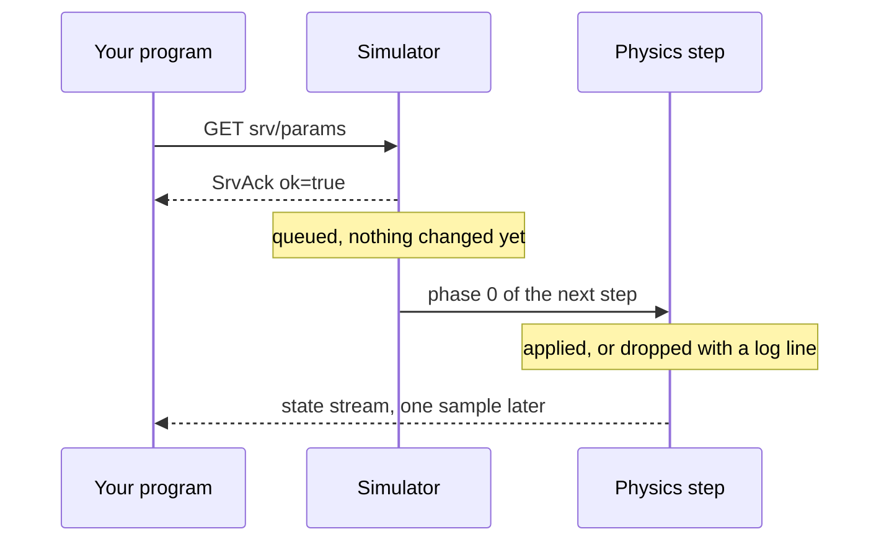

# Services and configuration

One-shot requests that change the robot rather than drive it, and why the reply is not the result.

## What a service is

A service is a zenoh query on `vrobots/{sys_id}/z/srv/{segment}`: you send one request, the
robot sends one reply, and the exchange is over. That is the opposite shape from a command,
which is a publication nobody answers (see
[Commands latch](../ch04-commands/01-latching.md)). Services carry configuration, which is
quasi-static: mass, noise models, rotor geometry, frames, the skin. Commands carry setpoints,
which change every loop iteration.

Two services live outside a robot's namespace. `vrobots/manager/z/srv/delete` belongs to the
scene manager, and `vrobots/scene/z/srv/frame` answers for the scene as a whole. Everything
else is per robot, keyed by [`sys_id`](../appendix-d-glossary.md).

## The ack is a receipt, not a result

Every reply is an `SrvAck`, and the simulator packs it the instant the query lands. The
change itself is applied in [phase 0](../appendix-d-glossary.md) of the robot's **next**
physics step, one step later.



So `Ok(())` means the robot heard you. It does not mean the robot agreed with you.

## Only `srv/skin` ever says no

`srv/skin` is the single service in this API that can answer `ok = false`, and it does so
only for a tier refusal. Everything else acks `ok` whatever you sent. A rotor list of the
wrong length, an unknown frame id, a `drive_mode` that is not 2 or 4, a noise block for a
sensor the robot does not carry: each is acked `ok` and then refused by a log line inside the
simulator that no client can read.

The SDK closes part of that gap by refusing what it can before anything reaches the wire. The
"Refused client-side" column of the table below is the whole of that protection; past it you
are on your own.

> **Gotcha.** A silently dropped request and a successful one are byte-for-byte identical from
> outside the simulator. Detect the difference by measuring the robot, never by reading the
> return value.

## The state stream is the confirmation

Because of that, the examples in this chapter measure rather than assert. `ex27` makes the
point deliberately by sending a rotor list one entry short, with a thrust curve that would
drop the aircraft out of the sky.

From `examples/rust/src/bin/ex27_rotor_config.rs`:

```rust
    robot.configure_rotors(&short)?;
    println!("... returned Ok. That is a receipt, and the request was dropped:");
    let dropped = climb(&robot, "after the short list", &collective)?;
```

<details>
<summary>The same in C++ (<code>examples/cpp/ex27_rotor_config.cpp</code>)</summary>

```cpp
robot.configure_rotors(shortlist);
std::printf("... returned without throwing. That is a receipt, and the request was "
            "dropped:\n");
const Run dropped = climb(robot, "after the short list", collective);
```

</details>

<details>
<summary>The same in Python (<code>examples/python/ex27_rotor_config.py</code>)</summary>

```python
robot.configure_rotors(short)
print("... returned without raising. That is a receipt, and the request was dropped:")
dropped = climb(robot, "after the short list", collective)
```

</details>

Each surface reports failure differently, and that is exactly what makes the point here: the
Rust `?`, the C++ `catch` and the Python `except` all stay quiet, because a dropped request
is acked `ok` on the wire and none of them has anything to raise.

The `?` never fires, and the aircraft climbs exactly as it did before, which is the proof that
nothing was applied:

```text
configure_rotors with <n-1> entries for <n> rotors ...
... returned Ok. That is a receipt, and the request was dropped:
-- after the short list --
   t=<seconds>s alt=<metres> m  climb=<rate> m/s  measured=[...]
```

## The service map

Every live robot serves the same seven keys, whatever its type:

| Segment | Method | Page |
|---|---|---|
| `activate` | (inside `connect`, no public method) | [Robot lifecycle](01-lifecycle.md) |
| `reset` | `reset` | [Robot lifecycle](01-lifecycle.md) |
| `params` | `set_physical_params` | [Mass and inertia](02-physical-params.md) |
| `sensors` | `configure_sensors` | [Sensor noise](03-sensor-config.md) |
| `frames` | `set_frames` | [Coordinate frames](04-frames-config.md) |
| `cameras` | `mount_camera`, `unmount_camera` | [Mount, open and unmount](../ch05-cameras/01-mount-open-unmount.md) |
| `skin` | `set_skin` | [Skins](08-skins.md) |

One more service belongs to each of four robot types, and to nothing else:

| Segment | Method | Robot | Page |
|---|---|---|---|
| `drive` | `configure_drive` | Truck | [The truck drivetrain](05-drive-config.md) |
| `rotors` | `configure_rotors` | Multirotor | [Rotors and thrust curves](06-rotor-config.md) |
| `msd` | `configure_msd` | Msd | [Mass spring damper and cart pole](07-msd-cartpole-config.md) |
| `cartpole` | `configure_cartpole` | CartPole | [Mass spring damper and cart pole](07-msd-cartpole-config.md) |

HalfDrone and GlobalHawk add nothing: their entire control surface is command-level.

Signatures, with what each refuses before publishing:

| Method | Signature | Topic | Refused client-side | Robot |
|---|---|---|---|---|
| `reset` | `() -> VrResult<()>` | `srv/reset` | nothing | all |
| `set_physical_params` | `(&PhysicalParams) -> VrResult<()>` | `srv/params` | empty request, mass not positive-finite, any MOI axis not positive-finite | all |
| `set_skin` | `(&str) -> VrResult<()>` | `srv/skin` | an empty name | all |
| `configure_sensors` | `(&SensorConfig) -> VrResult<()>` | `srv/sensors` | empty request, any non-finite value | all |
| `set_frames` | `(Option<&str>, &[DeviceFrame]) -> VrResult<()>` | `srv/frames` | both halves empty, an entry with an empty device or frame id | all |
| `scene_frame` | `() -> VrResult<SceneFrame>` | `vrobots/scene/z/srv/frame` | nothing | scene scope |
| `configure_drive` | `(&DriveConfig) -> VrResult<()>` | `srv/drive` | empty request, `drive_mode` not 2 or 4, any non-finite value | Truck |
| `configure_rotors` | `(&[RotorSpec]) -> VrResult<()>` | `srv/rotors` | an empty slice, any non-finite value | Multirotor |
| `configure_msd` | `(&MsdConfig) -> VrResult<()>` | `srv/msd` | empty request, a negative or non-finite value | Msd |
| `configure_cartpole` | `(&CartPoleConfig) -> VrResult<()>` | `srv/cartpole` | empty request, a non-positive mass, length or force, any non-finite value | CartPole |
| `delete` | `() -> VrResult<()>` | `manager/z/srv/delete` | already deleted | all |
| `is_deleted` | `() -> bool` | local flag | | all |

## Asking for a service the robot does not serve

A robot registers a queryable only for its own type's service, so `configure_drive` on a
multirotor is a query nobody answers. After `ConnectOptions::service_timeout` (8 seconds by
default) it returns [`VrError::NoResponder`](../appendix-c-errors.md).

That is not a failure mode to defend against, it is a capability probe: it is how
`ex30_hello_halfdrone` establishes that a HalfDrone serves the common seven and nothing more.
It is also indistinguishable from a simulator that is not running, so confirm with
`vrobots topic list` before drawing a conclusion.

**Next:** [Robot lifecycle](01-lifecycle.md)

**See also:** [Five rules that explain everything](../ch02-concepts/06-five-rules.md), [The topic namespace](../ch02-concepts/02-topics.md), [Appendix C: Error reference](../appendix-c-errors.md)
