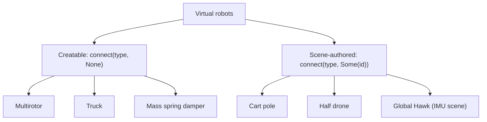

# Supported virtual robots

The roster: which robots exist, which you can create, and what each one accepts.

Six robot types are reachable from the SDK. Three of them you can ask the simulator to
spawn; three exist only where a scene author placed them, and you attach to those by
`sys_id`. This page is the index. The six pages after it use one fixed template, so you
can compare any two robots section by section.

## The roster

| Robot | `RobotType` | Catalog key | Creatable | Drive command | Type-specific service |
|---|---|---|---|---|---|
| [Multirotor](01-multirotor.md) | `Multirotor` | `multirotor` | yes | `SET_MR_PWM` | `srv/rotors` |
| [Truck](02-truck.md) | `Truck` | `truck` | yes | `SET_CAR` | `srv/drive` |
| [Mass spring damper](03-msd.md) | `Msd` | `msd` | yes | `SET_MSD` | `srv/msd` |
| [Cart pole](04-cartpole.md) | `CartPole` | `cartpole` | no, scene-authored | `SET_INVPEN` | `srv/cartpole` |
| [Half drone](05-halfdrone.md) | `HalfDrone` | `halfdrone` | no, scene-authored | `SET_MR_PWM`, exactly two values | none |
| [Global Hawk](06-globalhawk.md) | `GlobalHawk` | `globalhawk` | no, scene-authored | `SET_ANGVEL` tracking, or direct surfaces | none |

`RobotType::from_catalog_key` is case-insensitive and accepts synonyms: `car` for the
truck, `cart_pole` and `invpen` for the cart pole, `mass_spring_damper` for the mass spring
damper, `half_drone` for the half drone, `global_hawk` and `rq4b` for the Global Hawk. Only
`catalog_key()` ever reaches the wire.

## Creatable and scene-authored

The create catalog belongs to the **scene**, not to the SDK. The sandbox scene registers
`multirotor`, `truck` and `msd`; the Global Hawk lives in the IMU scene instead. Asking
`srv/create` for anything else is refused with a message naming the keys that scene does
know, which is also the only live way to enumerate a catalog.



A creatable robot can also be attached to: `connect(RobotType::Multirotor, Some(1))` never
touches `srv/create` and works for any robot the scene contains, whatever the catalog says.
The arrow runs one way only, so a scene-authored type has exactly one route in.

System ids are allocated at scene load and keep incrementing across loads, so no constant
in an example is a contract. Read the live ids with `vrobots topic list`.

```sh
vrobots topic list
```

## What every live robot serves

Seven services are common to every robot that is publishing, on
`vrobots/{sys_id}/z/srv/{segment}`:

| Segment | SDK method | What it does |
|---|---|---|
| `activate` | part of `connect` | brings a created robot online |
| `reset` | `reset()` | teleports home, zeroes velocity, re-latches the initial command |
| `params` | `set_physical_params` | mass and principal moments of inertia |
| `skin` | `set_skin` | appearance, from a per-type catalog |
| `cameras` | `mount_camera`, `unmount_camera` | camera upsert and remove |
| `sensors` | `configure_sensors` | the sensor noise model |
| `frames` | `set_frames` | robot-level and device-level coordinate frames |

Each robot type then adds at most one service of its own, as tabulated above. Asking a
robot for a service its type does not serve returns `VrError::NoResponder` after the
service timeout, and that is the only capability probe this API has: nothing in a state
message names the robot's type.

> **Gotcha.** `srv/reset` is the one service key where a payload-less GET performs the
> action instead of probing it. Probe any other key freely; never probe this one.

## How to read the six pages

Every robot page carries the same eight sections in the same order: Identity, Physical
model, Commands accepted, Services, Frame and units, Cameras, Known quirks, Example. A
section with nothing to report says so rather than disappearing, so a blank is a fact and
not an omission.

Two kinds of fact are deliberately missing throughout the chapter, because the repository
does not contain them: default prefab masses and inertias, and a per-robot list of which
sensors the airframe actually carries. Both are marked where they would have gone.

**Next:** [Multirotor](01-multirotor.md)

**See also:** [System ids, and the two kinds of robot](../ch02-concepts/03-sys-id.md), [Sending commands](../ch04-commands/00-intro.md), [Services and configuration](../ch06-services/00-intro.md), [Known simulator issues](07-known-issues.md)
