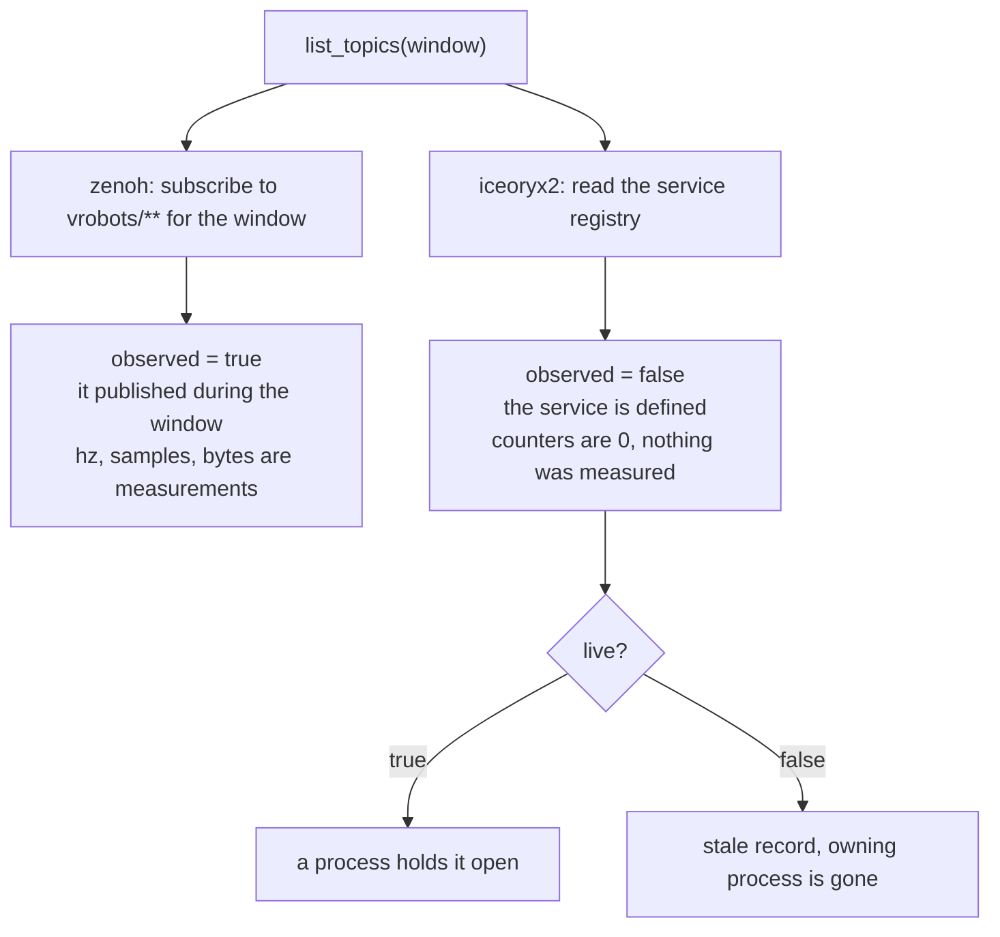

# Discovery from code

You get the same answer `vrobots topic list` gives, as data your program can branch on.

```sh
cargo run -p vrobots-examples --bin ex11_topic_discovery
./target/cpp-build/ex11_topic_discovery
python examples/python/ex11_topic_discovery.py
```

Discovery needs no robot and no `connect`. It answers "is the simulator publishing,
and under which ids" before you have a handle to ask with, which is the order those
two questions actually occur in.

## The calls

Two listing calls and one capability question. From
`crates/vrobots-sdk/src/discovery.rs`:

```rust
pub fn list_topics(timeout: Duration) -> VrResult<Vec<TopicInfo>>
pub fn list_topics_with(timeout: Duration, options: &ConnectOptions) -> VrResult<Vec<TopicInfo>>
pub fn discovery_covers_all_transports() -> bool
```

<details>
<summary>The same in C++ (<code>cpp/include/vrobots_sdk.hpp</code>)</summary>

```cpp
inline std::vector<TopicInfo> list_topics(double timeout_s = 1.5,
                                          const vrsdk_connect_options_t* options = nullptr)
```

</details>

<details>
<summary>The same in Python (<code>crates/vrobots-sdk-py/python/vrsdk/_vrsdk.pyi</code>)</summary>

```python
def list_topics(
    timeout: float = 1.5, router: Optional[str] = None
) -> list[TopicInfo]: ...
```

</details>

Rust splits the plain and the options-taking call in two; C++ and Python fold both into
one function with defaulted trailing arguments, and Python narrows the options to the
one field that matters here, `router`. Neither wrapper exposes
`discovery_covers_all_transports`: it exists only as `vrsdk_discovery_covers_all_transports`
in `crates/vrobots-sdk-capi/include/vrobots_sdk.h`.

The listing calls block for `timeout` and print nothing; what they return is the
vector described below.

The result is sorted by `(sys_id, key)`, so it is stable run to run. `list_topics_with`
takes a `ConnectOptions` for the one field that matters here, `router_endpoint`, which
reaches a simulator on another host. `discovery_covers_all_transports` returns `true`
in this build and exists so a future build without shared memory can say that camera
streams are missing rather than let an absent stream read as a broken camera.

An empty vector is a legitimate result, not an error. `VrError::Session` is what you
get when zenoh will not open or the iceoryx2 registry cannot be read.

## `TopicInfo`

| Field | Type | Notes |
|---|---|---|
| `key` | `String` | The full key expression, e.g. `vrobots/1/z/state`. For iceoryx2 it is also the service name. |
| `transport` | `Transport` | `Zenoh` or `Iceoryx2`. `transport.tag()` gives `"z"` or `"i"`. |
| `sys_id` | `Option<u32>` | The owning robot, or `None` for the `manager` and `scene` keys. |
| `observed` | `bool` | `true` when the entry came from watching traffic, `false` when it came from a registry. |
| `live` | `bool` | Whether anything currently holds the topic open. Always `true` for zenoh. |
| `samples` | `u64` | Payloads seen during the window. `0` when `observed` is false. |
| `bytes` | `u64` | Total payload bytes during the window. `0` when `observed` is false. |
| `hz` | `f64` | `samples / window`. `0.0` when `observed` is false. |

## Observed versus registered

`observed` is the field the rest of the struct depends on, and it exists because the
two transports answer "what topics are there" by completely different means.



Zenoh has no registry. The only honest way to enumerate it is to subscribe to
`vrobots/**` for a window and report what arrived, so a topic appears only if it
published during your window, and its counters are real measurements. The
consequence is a false negative on slow topics: `vrobots/*/z/frames` publishes at
1 Hz, so a 0.5 s window loses it entirely. State runs at 25 Hz, so about a second is
enough for it.

iceoryx2 does have a registry. An entry means the service is defined, which is not
the same as the service producing frames: it may be streaming, or it may be a dead
leftover from a process that exited. `live` is what separates those two. Nothing was
watched either way, so `samples`, `bytes` and `hz` are all zero and mean "not
measured" rather than "zero traffic".

> **Gotcha.** A router endpoint makes the result asymmetric. Zenoh topics come back
> from wherever the simulator is, while the iceoryx2 half only ever sees this host,
> so a remote simulator lists states and services and no camera streams. That is
> what shared memory means, not a discovery failure.

## Reading the flag

From `examples/rust/src/bin/ex11_topic_discovery.rs`, the print loop is a three-way
branch on `observed` and `live` rather than a two-way one:

```rust
    println!("\n{:<4} {:>7} {:>9}  topic", "wire", "Hz", "bytes");
    for t in &topics {
        // `observed` decides whether the numbers mean anything at all.
        let (hz, bytes) = if t.observed {
            (format!("{:.1}", t.hz), t.bytes.to_string())
        } else if t.live {
            ("-".to_string(), "-".to_string())
        } else {
            ("stale".to_string(), "-".to_string())
        };
        println!("[{}] {hz:>7} {bytes:>9}  {}", t.transport.tag(), t.key);
    }
```

<details>
<summary>The same in C++ (<code>examples/cpp/ex11_topic_discovery.cpp</code>)</summary>

```cpp
        std::printf("\n%-4s %7s %9s  topic\n", "wire", "Hz", "bytes");
        for (const vrsdk::TopicInfo& t : topics) {
            // `observed` decides whether the numbers mean anything at all.
            if (t.observed) {
                std::printf("[%s] %7.1f %9llu  %s\n", t.transport, t.hz,
                            static_cast<unsigned long long>(t.bytes), t.key.c_str());
            } else {
                std::printf("[%s] %7s %9s  %s\n", t.transport, t.live ? "-" : "stale", "-",
                            t.key.c_str());
            }
        }
```

</details>

<details>
<summary>The same in Python (<code>examples/python/ex11_topic_discovery.py</code>)</summary>

```python
    print(f"\n{'wire':<4} {'Hz':>7} {'bytes':>9}  topic")
    for t in topics:
        # `observed` decides whether the numbers mean anything at all.
        if t.observed:
            hz, nbytes = f"{t.hz:.1f}", str(t.bytes)
        elif t.live:
            hz, nbytes = "-", "-"
        else:
            hz, nbytes = "stale", "-"
        print(f"[{t.transport}] {hz:>7} {nbytes:>9}  {t.key}")
```

</details>

Rust reaches the wire tag through a method, `t.transport.tag()`, because `Transport` is
an enum; C++ and Python both hand you `t.transport` already as the string `"z"` or `"i"`.

Printing `0.0` for a registry entry would be reporting a measurement nobody took.
`-` says the number does not exist, and `stale` says the entry does not either.

## Grouping by robot

The reason to do this in code rather than at the command line is that the result is
data. Grouping by `sys_id` is how a program answers "which robots exist, and does the
one I want have a camera".

```rust
    let mut by_robot: BTreeMap<Option<u32>, Vec<&str>> = BTreeMap::new();
    for t in &topics {
        by_robot.entry(t.sys_id).or_default().push(&t.key);
    }
```

<details>
<summary>The same in C++ (<code>examples/cpp/ex11_topic_discovery.cpp</code>)</summary>

```cpp
        std::map<std::optional<std::uint32_t>, std::vector<std::string>> by_robot;
        for (const vrsdk::TopicInfo& t : topics) {
            by_robot[t.sys_id].push_back(t.key);
        }
```

</details>

<details>
<summary>The same in Python (<code>examples/python/ex11_topic_discovery.py</code>)</summary>

```python
    by_robot: dict[int | None, list[str]] = defaultdict(list)
    for t in topics:
        by_robot[t.sys_id].append(t.key)
```

</details>

The absent id is `Option<u32>` in Rust, `std::optional<std::uint32_t>` in C++ and `None`
in Python, and all three sort or group on it directly. Rust and C++ get the ordering for
free from `BTreeMap` and `std::map`; Python's `dict` does not order, so the example sorts
the keys itself before printing.

`manager` and `scene` sit where an id would in the key, so they can never collide
with a robot, and they parse as `None`.

The whole example prints the table and then the grouping:

```text
listening for 1.5s ...

wire      Hz     bytes  topic
[i]       -         -  vrobots/1/i/cam/front_left/720p_rgba8
[i]       -         -  vrobots/1/i/cam/front_right/720p_rgba8
[z]     1.3      1760  vrobots/1/z/frames
[z]    25.3     45600  vrobots/1/z/state

by robot:
  sys_id 1: 4 topic(s)
      vrobots/1/i/cam/front_left/720p_rgba8
      vrobots/1/i/cam/front_right/720p_rgba8
      vrobots/1/z/frames
      vrobots/1/z/state
```

<!-- VERIFY: the sample values in the block above (rates, byte totals, which cameras the test scene ships and on which sys_id) are reconstructed from the example's format strings and need a live-simulator capture to confirm. -->

**Next:** [Versions and pins](03-version-and-pins.md)

**See also:** [The vrobots command](01-cli.md), [Two transports, one simulator](../ch02-concepts/01-transports.md), [The topic namespace](../ch02-concepts/02-topics.md)
